# AILab AI指标工坊 · 指标中心模块（原型批注需求）

| 项目 | 说明 |
|------|------|
| 产品 | AILab AI指标工坊 |
| 模块 | 指标中心 |
| 文档风格 | 原型截图 / 区域 → **需求说明** + **交互说明** |
| 版本 | V1.0（批注版） |
| 日期 | 2026-08-11 |
| 原型文件 | `indicator-center.html` |
| 截图目录 | `docs/prd-screenshots/indicator-center/` |
| 上游关联 | 数据源模块（三源绑定 / 手工加入）产出的指标在此聚合、计算与消费 |
| 下游关联 | 图库新建图表「选择指标」、研报 / BI 等 |
| 维护约定 | **原型变更时须同步更新本文档（`.md` + `.html`）与截图** |

> 阅读方式：每张图下方用 **①②③…** 对应界面区域。  
> - **需求说明**：业务目标、规则、约束、验收口径  
> - **交互说明**：点哪里、发生什么、即时反馈  

### 模块定位

指标中心是投研平台的**指标资产主库**：聚合来自数据源的基础（原始）指标，支持计算指标、代码运算、替换引用、目录治理与时序详情分析；计算指标可查看溯源关联图。

### 指标类型

| 类型 | 含义 | 典型来源 | 专属能力 |
|------|------|----------|----------|
| 基础指标 | 原始时序，无公式依赖 | 数据源绑定 / 添加指标 / 手工加入 | 启停、编辑信息、添加最新值 |
| 计算指标 | 由公式 / 算子 / 代码生成 | 计算指标弹层、代码运算 | 溯源关联图、重新计算、查看公式 |

---

## 0. 范围与入口

```
侧边栏 · 指标中心  →  indicator-center.html
```

**本期范围：** 目录治理、指标浏览（卡片/列表）、添加基础指标、计算指标（多算子）、替换指标、代码运算、批量移动、详情走势/季节性/时间段、编辑信息、添加最新值、计算指标溯源。

**规划中 / 占位（原型未落地逻辑）：** 「只看我的」、工具栏「数据调整」、收藏星标、溯源「关联指标」完整列表页、目录跨层级移动（上级目录控件禁用）。

---

## 1. 总览布局

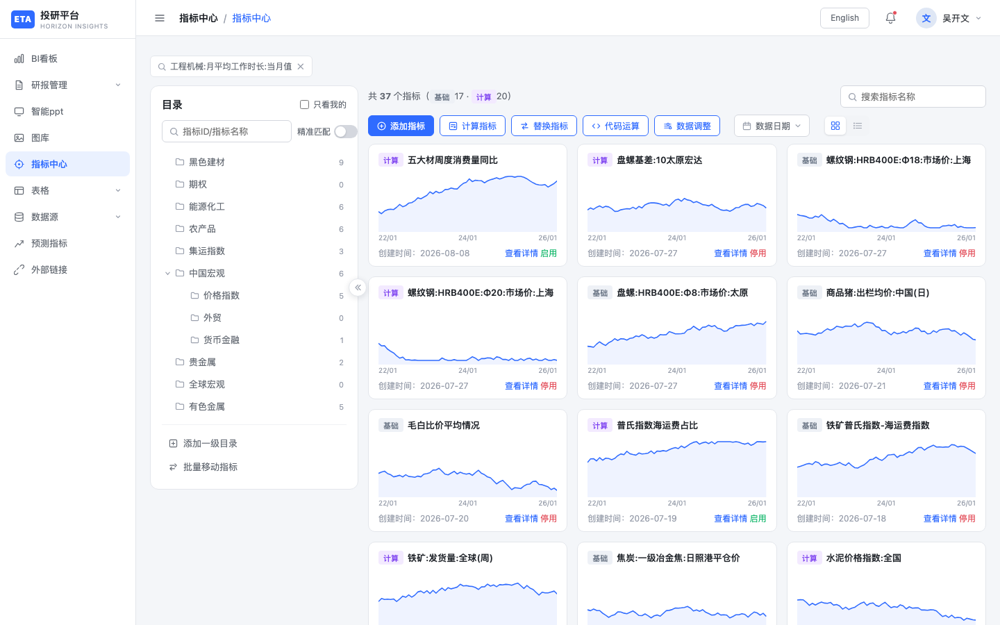

| 编号 | 区域 | 需求说明 | 交互说明 |
|------|------|----------|----------|
| ① | 侧栏「指标中心」 | 平台级指标资产入口，与数据源配置页分离 | 菜单高亮；面包屑「指标中心」 |
| ② | 顶栏 | 全局导航与账号区，不承载业务筛选 | 汉堡、English、通知、用户 |
| ③ | 条件 chips（可选） | 预留多条件筛选摘要，可移除单条件 | 点击 chip 关闭可移除该项（演示） |
| ④ | 左：目录面板 | 按业务分类组织指标；支撑增删改与批量移动 | 见 §2 |
| ⑤ | 右：指标区 | 浏览、筛选、创建与进入详情的主工作区 | 见 §3 |
| ⑥ | 工具栏主操作 | 覆盖「引入 / 计算 / 替换 / 代码」核心作业 | 添加指标、计算指标、替换指标、代码运算；数据调整为规划占位 |

---

## 2. 目录面板

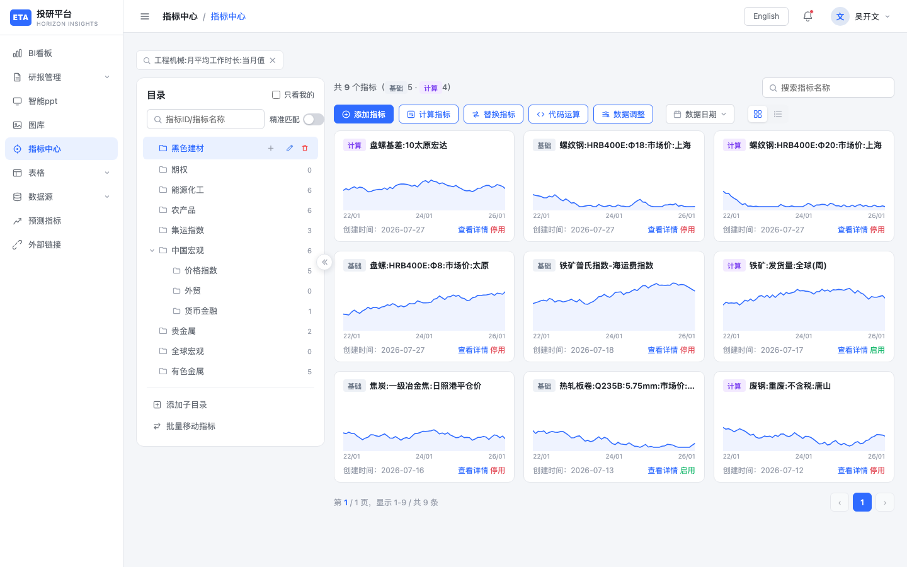

| 编号 | 区域 | 需求说明 | 交互说明 |
|------|------|----------|----------|
| ① | 标题「目录」 | 明确左栏职责为分类导航 | 固定标题 |
| ② | 「只看我的」 | **规划中**：个人相关指标过滤（原型仅 UI） | 勾选暂无过滤逻辑 |
| ③ | 搜索 + 精准匹配 | 在深树中按指标 ID/名称定位；精准模式用于核验全名/ID | 与右侧 `#gridSearch` 双向同步；开精准=完全相等，关=模糊包含；切换 Toast |
| ④ | 目录树 | 多级业务分类；角标反映本级及子路径指标数；操作对齐数据源/图库习惯 | 点击选中过滤右侧；再点取消=全部；箭头展开/收起；hover 显示＋/编辑/删除 |
| ⑤ | 行内「＋」 | 就地添加子目录，路径 `父/子` | 打开添加目录弹窗，上级预填当前路径 |
| ⑥ | 行内编辑 / 删除 | 改名需同步指标 `dir`；删除需确认（含子目录） | 编辑弹窗；删除确认后移除节点并清理筛选 |
| ⑦ | 添加一级/子目录 | 未选中建根；选中建子级，降低误建层级 | 底部按钮文案随选中态切换 |
| ⑧ | 批量移动指标 | 目录重组时批量改挂，避免逐条操作 | 打开 §7 弹窗 |
| ⑨ | 折叠目录 | 扩大右侧可视区 | 边缘箭头收起/展开面板 |

### 2.1 添加目录

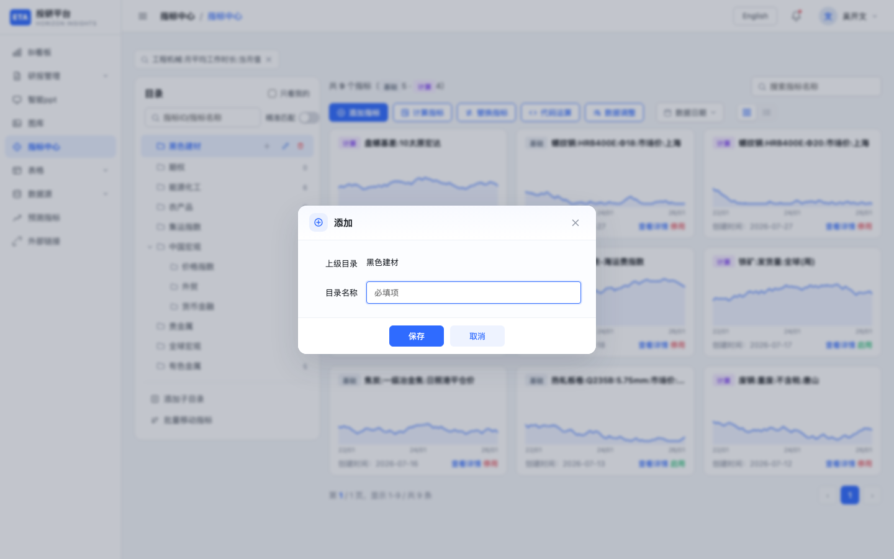

| 编号 | 区域 | 需求说明 | 交互说明 |
|------|------|----------|----------|
| ① | 上级目录 | 明确挂载点，防止建错层级 | 只读展示上级路径或「—」（一级） |
| ② | 目录名称 | 必填；同级唯一；禁止路径分隔符 | 输入框；含 `/ \` Toast 拦截；同名拦截 |
| ③ | 保存 / 取消 | 保存后可选中新目录并刷新树计数 | 保存落库演示；取消不落库 |

**编辑目录补充需求：** 原型限制「只能移动到同一层级」（上级下拉禁用）；改名后同步 `gridDir` 与指标路径前缀。  
**删除目录补充需求：** 删除含子目录；若当前筛选落在被删树上则清空筛选。

---

## 3. 指标列表区（卡片 / 列表）

### 3.1 卡片视图与筛选

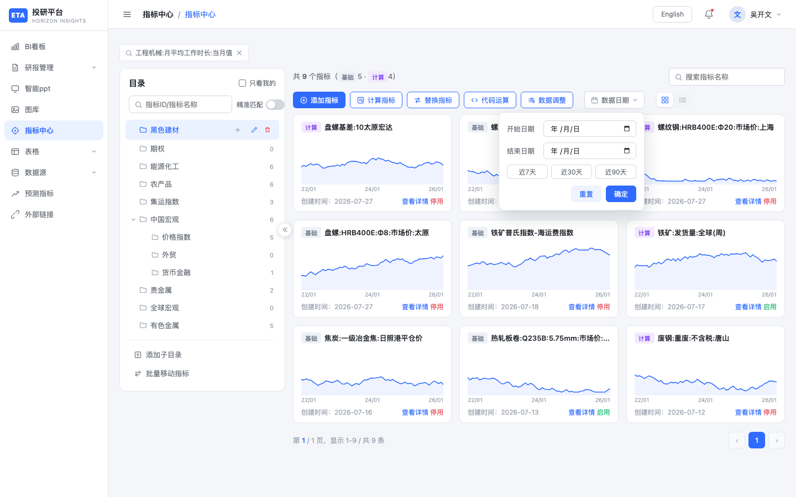

| 编号 | 区域 | 需求说明 | 交互说明 |
|------|------|----------|----------|
| ① | 数量统计 | 展示当前筛选下总量，并拆分基础/计算，便于资产结构感知 | `共 N 个指标（基础 x · 计算 y）` |
| ② | 名称搜索 | 在结果集内二次过滤名称/ID | 受精准匹配开关影响 |
| ③ | 创建时间筛选 | 按指标**创建时间**缩小范围（非数据最新日期） | 起止日期；快捷近 7/30/90 天；起≤止；重置清空 |
| ④ | 视图切换 | 卡片偏浏览走势；列表偏运维字段与行内操作 | 卡片 / 列表互斥，切换保留筛选与页码策略（重置见实现） |
| ⑤ | 卡片内容 | 快速识别类型、名称、走势形态与状态 | 类型标签、名称、迷你图、创建时间、「查看详情」、状态文案 |
| ⑥ | 进入详情 | 详情为分析主场景，需一键可达 | 点击卡片或「查看详情」进入全屏详情 §8 |
| ⑦ | 分页 | 默认每页 12 条，避免一次渲染过大 | 底部分页条：上一页/页码/下一页 + 区间信息 |

### 3.2 列表视图

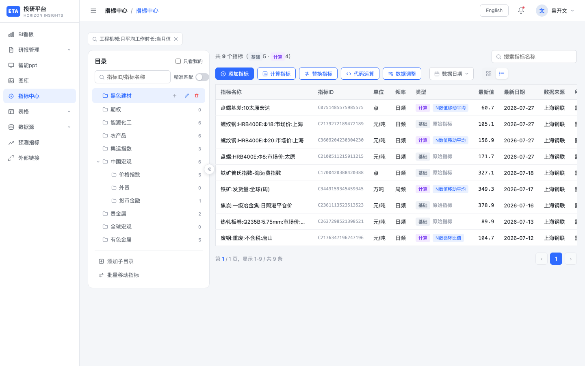

| 编号 | 区域 | 需求说明 | 交互说明 |
|------|------|----------|----------|
| ① | 表格列 | 运维视角需覆盖标识、口径、类型、最新点、来源、目录、状态 | 名称、指标ID、单位、频率、类型（基础/计算+算子或「原始指标」）、最新值、最新日期、数据来源、所属目录、创建时间、状态、操作 |
| ② | 查看详情 | 与卡片一致进入全屏详情 | 行内链接 |
| ③ | 启用 / 停用 | 控制指标是否可被下游选用（演示态切换） | 切换状态并 Toast |
| ④ | 删除 | 高危操作需确认，防误删资产 | confirm 后从列表移除并 Toast |

**空态需求：** 无匹配时提示调整关键词或日期范围，不展示伪数据。

---

## 4. 添加指标（基础指标）

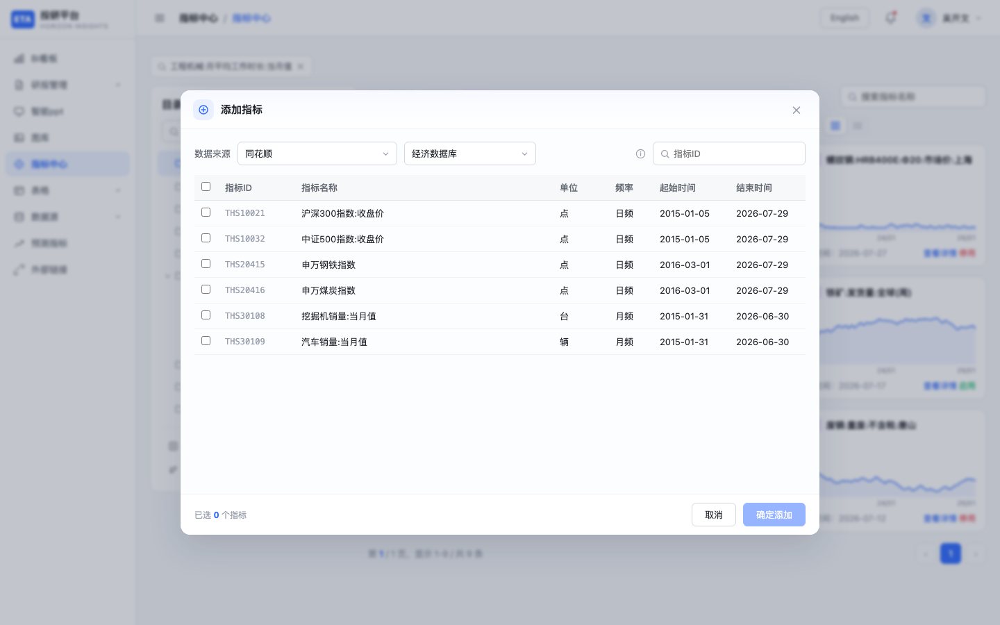

| 编号 | 区域 | 需求说明 | 交互说明 |
|------|------|----------|----------|
| ① | 入口「添加指标」 | 从外部库/源按 ID 引入**基础指标**到中心 | 打开添加弹窗 |
| ② | 数据来源 / 数据库 | 限定检索范围，对齐多源接入 | 下来选择来源与库 |
| ③ | 按 ID 搜索 | 已知 ID 快速检索候选 | 输入过滤候选表 |
| ④ | 候选表多选 | 支持一次引入多条；展示单位/频率/起止便于核对 | 勾选、全选；底部「已选 N」；0 选中时确认禁用 |
| ⑤ | 已存在处理 | **禁止重复引入**：已在库中的指标进入确认只读态，引导先删原指标 | 警告条 + 只读行；主按钮变为「知道了」 |
| ⑥ | 确认添加 | 写入中心，`kind=base`，默认启用 | 成功 Toast 并刷新列表 |
| ⑦ | 取消 | 不落库 | 关闭弹窗 |

---

## 5. 计算指标

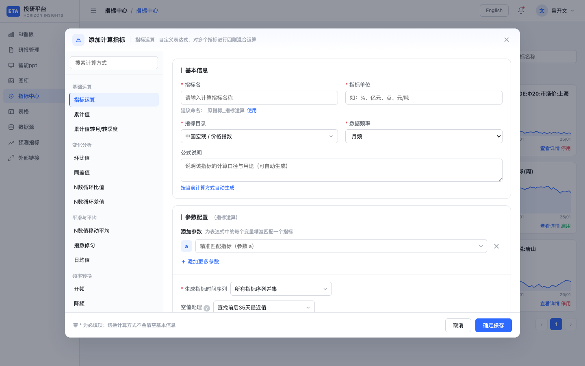

| 编号 | 区域 | 需求说明 | 交互说明 |
|------|------|----------|----------|
| ① | 入口「计算指标」 | 用可视化算子从已有指标派生新序列，沉淀可复用计算资产 | 打开全屏/遮罩计算配置层 |
| ② | 计算方式导航 | 约 6 组、19 种算子（运算、变换、统计等），可搜索 | 左侧分类列表 + 搜索；切换方式不清空已填基本信息 |
| ③ | 基本信息 | 名称、单位、目录、频率为资产落库必要字段 | 名称/目录必填（保存校验）；目录用级联选择器 |
| ④ | 建议命名 / 公式说明 | 降低命名不一致与文档缺失 | 一键采用建议名；可生成说明文案 |
| ⑤ | 参数绑定 | 表达式变量须**精准匹配**到具体指标；控制复杂度 | 参数 ≤10；分段 ≤5；扩散子指标 ≤20；至少保留 1 行 |
| ⑥ | 时间与空值策略 | 多序列对齐与缺失处理影响结果可信度 | 时间并集/指定区间；空值策略含「前后 35 天最近值」等 |
| ⑦ | 公式预览 | 保存前可核对表达式语义 | 预览区实时/刷新展示 |
| ⑧ | 保存 | 生成 `kind=calc` 指标，记录算子标签与目录 | 校验通过后写入列表并 Toast |

**验收要点：** 超上限 Toast 拦截；未填名称/目录不可保存；保存后类型标签为「计算」。

---

## 6. 替换指标

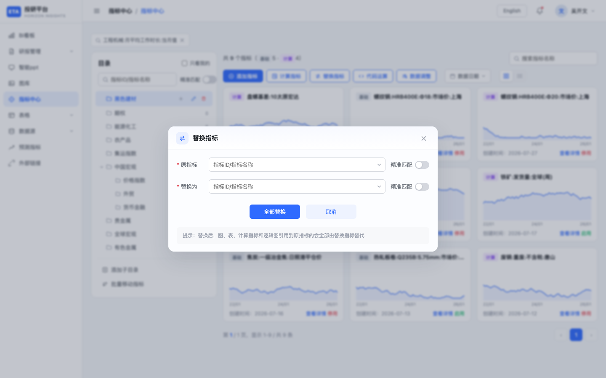

| 编号 | 区域 | 需求说明 | 交互说明 |
|------|------|----------|----------|
| ① | 入口「替换指标」 | 当底层序列变更时，批量替换图、表、计算、逻辑图中的引用，降低级联改造成本 | 打开替换弹窗 |
| ② | 原指标 | 被替换对象，需可搜索定位 | 带精准匹配的选择器 |
| ③ | 替换为 | 新引用目标；不得与原指标相同 | 同上；两端必选且不同 |
| ④ | 全部替换 | 一次性替换所有引用（演示） | 确认后 Toast 说明影响范围 |
| ⑤ | 取消 | 不执行替换 | 关闭 |

---

## 7. 代码运算

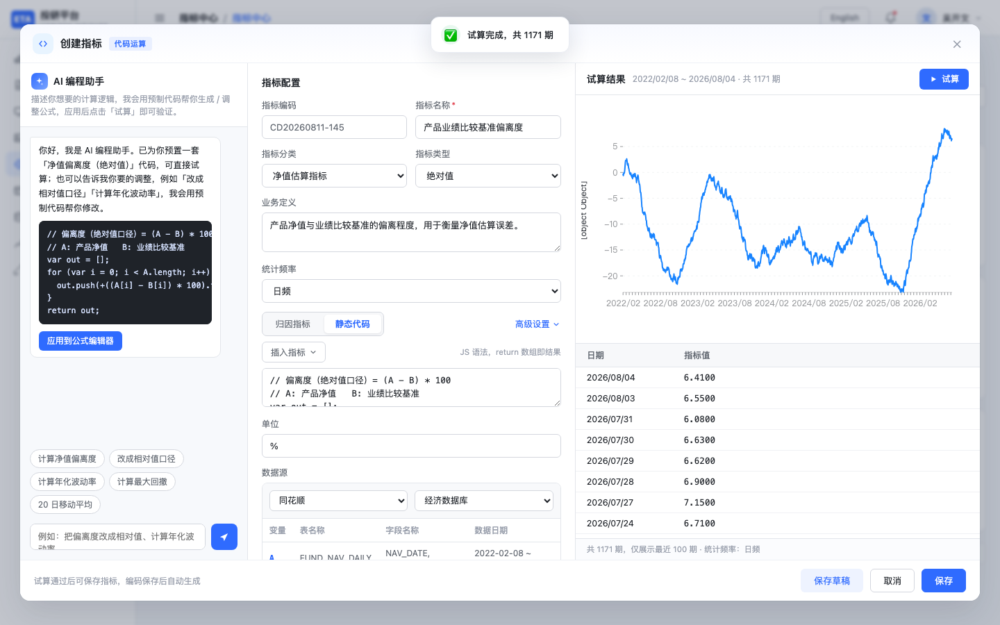

| 编号 | 区域 | 需求说明 | 交互说明 |
|------|------|----------|----------|
| ① | 入口「代码运算」 | 面向复杂/自定义逻辑，用脚本定义指标，补齐可视化算子覆盖不足 | 打开三栏代码工作台 |
| ② | 左：AI 辅助 | 降低公式编写门槛；可套用模板到编辑器 | 对话区、快捷 chips、「应用到公式编辑器」 |
| ③ | 中：配置与代码 | 编码系统生成且只读，保证唯一；名称必填；支持归因/静态代码双 Tab | 编码自动生成；名称*；分类/类型/定义/频率；`@` 插入变量；缺失值/小数位/年化等高级项 |
| ④ | 数据源表 | 声明脚本依赖的输入序列 | 表格维护引用 |
| ⑤ | 右：试算 | 保存前验证脚本可运行且返回时序数组 | 「试算」跑 JS；图+最近 100 期表；语法/运行错误 Toast |
| ⑥ | 存草稿 / 保存 | 草稿演示；保存加入指标列表（原型未强制试算通过） | 名称必填后可保存 |

---

## 8. 批量移动指标

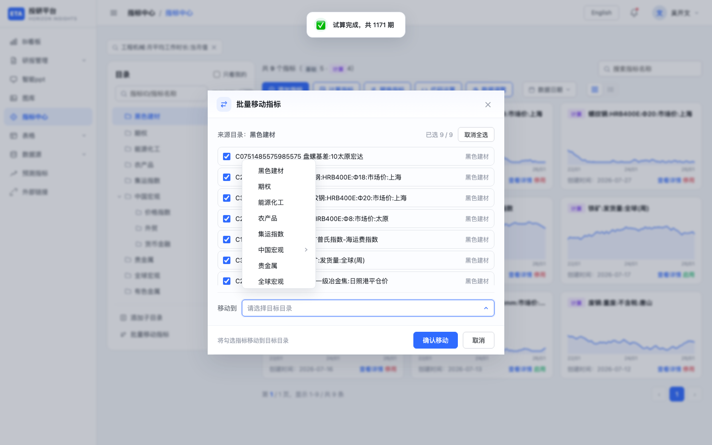

| 编号 | 区域 | 需求说明 | 交互说明 |
|------|------|----------|----------|
| ① | 入口 | 支持目录重组与纠错挂载 | 目录底「批量移动指标」 |
| ② | 来源与可选集 | 默认当前筛选结果，避免误移全局 | 展示来源目录或「全部」；列表为 `filteredCards` |
| ③ | 勾选 / 全选 | 可部分移动 | 行勾选；全选切换；计数「已选 a / b」 |
| ④ | 移动到 | 目标目录级联，支持深路径 | 级联选择器；未选不可确认 |
| ⑤ | 确认移动 | 批量更新 `dir`，刷新树角标与列表 | 当前目录无指标时入口 Toast 拦截 |
| ⑥ | 取消 | 不落库 | 关闭 |

---

## 9. 指标详情（全屏）

> 详情为**全屏视图**（非右侧抽屉），左侧可切换同批指标，右侧为走势与数据。

### 9.1 走势主界面

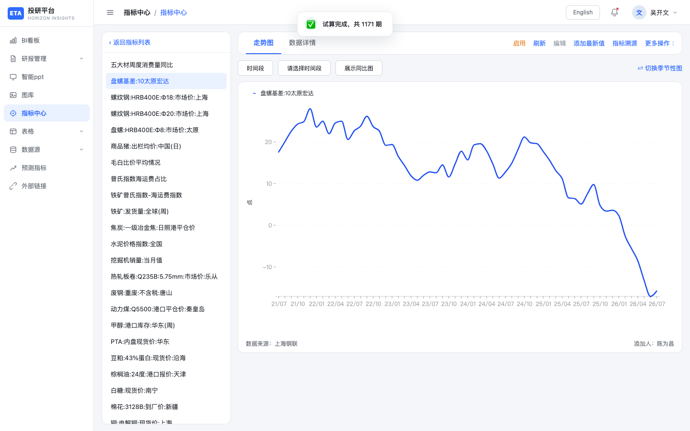

| 编号 | 区域 | 需求说明 | 交互说明 |
|------|------|----------|----------|
| ① | 返回 | 回到列表/卡片工作区 | 「返回」关闭详情 |
| ② | 左侧指标列表 | 在详情内快速切换对比对象 | 点击切换当前指标并重载图 |
| ③ | Tab：走势图 / 数据详情 | 图形分析与字段/明细分离 | 分段切换 |
| ④ | 启停 / 刷新 / 编辑 / 添加最新值 | 运维与补数入口集中在详情头 | 启停 Toast；编辑→§9.4；添加最新值→§9.5 |
| ⑤ | 指标溯源（仅计算） | 原始指标无公式依赖，不展示溯源；计算指标可追溯参数链 | 仅计算指标显示；下拉：关联图 / 关联指标（后者演示 Toast） |
| ⑥ | 更多菜单 | 收敛低频操作 | 编辑信息；计算专属：重新计算、查看公式、关联图/指标；通用：复制数据、添加最新值 |
| ⑦ | 主图 | 默认平滑曲线；可叠加同比 | G2 渲染；「去年同期」虚线（季节性模式下隐藏） |
| ⑧ | 时间段 | 控制可视窗口；默认近 5 年 | 打开时间段弹窗 §9.3 |
| ⑨ | 脚注 | 标明来源与添加人，满足溯源合规 | 数据来源、添加人 |

### 9.2 季节性图

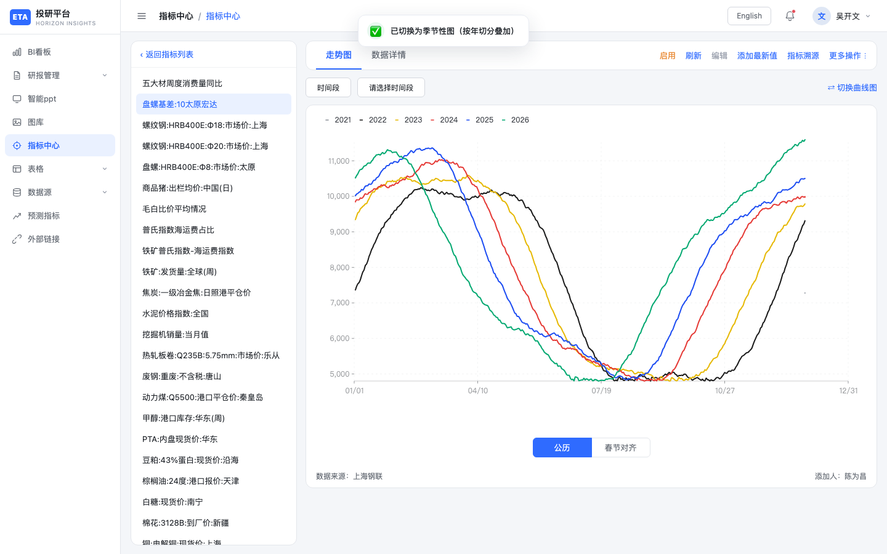

| 编号 | 区域 | 需求说明 | 交互说明 |
|------|------|----------|----------|
| ① | 曲线 / 季节性切换 | 季节性用于跨年形态对比，与普通曲线互斥场景 | Toggle 切换；季节性时隐藏「去年同期」 |
| ② | 公历 / 春节对齐 | 农产品等品种需按春节日历观察 | 春节对齐按春节点前后窗口重切序列 |
| ③ | 多年叠加 | 按年切分为多条曲线叠加 | 图例按年份区分 |

### 9.3 时间段设置

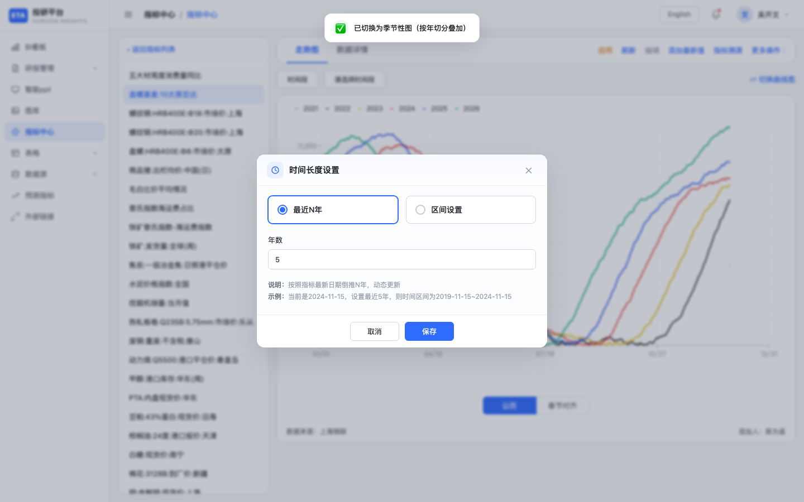

| 编号 | 区域 | 需求说明 | 交互说明 |
|------|------|----------|----------|
| ① | 最近 N 年 | 快捷窗口，N∈[1,50]，按最新日倒推 | 数字输入 + 确认 |
| ② | 自定义区间 | 精确起止 | 起止日期；起≤止校验 |
| ③ | 确定 / 取消 | 确定后重绘主图 | 关闭弹窗 |

### 9.4 编辑信息

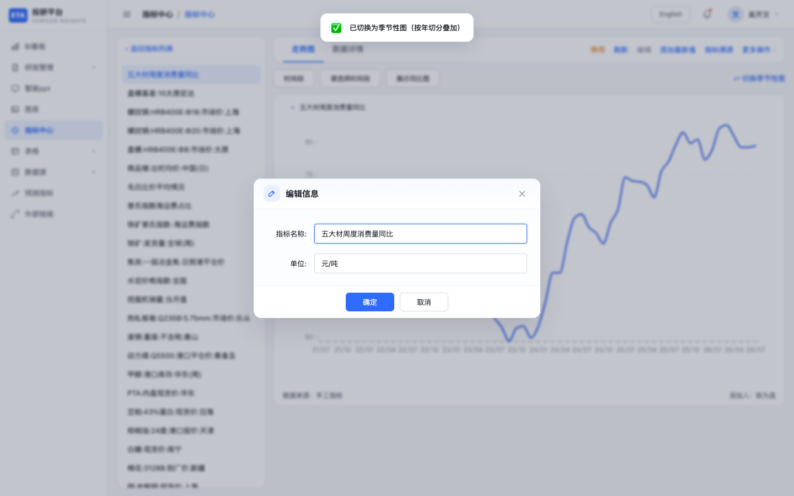

| 编号 | 区域 | 需求说明 | 交互说明 |
|------|------|----------|----------|
| ① | 指标名称 | 必填；**全局同名唯一**，避免资产混淆 | 重名拦截 Toast |
| ② | 单位 | 展示口径，可改 | 文本输入 |
| ③ | 保存 | 回写列表与详情头 | 成功 Toast |

### 9.5 添加最新值

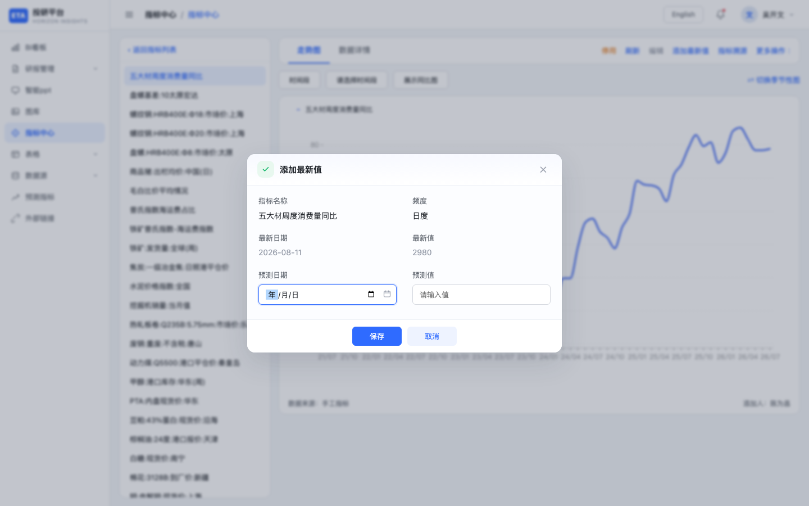

| 编号 | 区域 | 需求说明 | 交互说明 |
|------|------|----------|----------|
| ① | 只读上下文 | 明确补数对象与当前最新点 | 名称、频度、当前最新只读 |
| ② | 预测日期 / 预测值 | 人工补最新点（演示字段名）；值须为有效数字 | 日期 + 数值；校验后写入并同步列表「最新值」 |
| ③ | 保存 | 更新 `LATEST_MAP` 演示存储 | Toast 成功 |

### 9.6 数据详情 Tab

| 编号 | 区域 | 需求说明 | 交互说明 |
|------|------|----------|----------|
| ① | 基本信息 | ID、名称、目录、频度、单位 | 只读卡片 |
| ② | 来源与计算 | 来源、计算类型、起始/更新、添加人 | 只读卡片 |
| ③ | 数据明细 | 近 60 日点位抽查；最新点高亮 | 默认可折叠；展示条数 |

---

## 10. 指标溯源（计算指标）

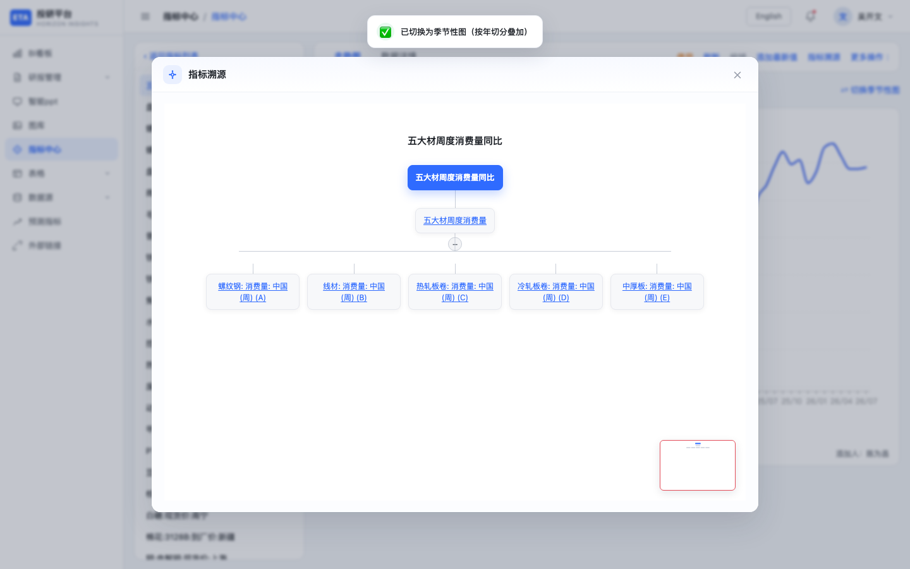

| 编号 | 区域 | 需求说明 | 交互说明 |
|------|------|----------|----------|
| ① | 入口约束 | **仅计算指标**可溯源；原始指标提示「无需溯源」 | 详情头「指标溯源」→「关联图」 |
| ② | 关联图结构 | 展示 root → 中间层 → 叶子参数（字母）依赖链，支撑审计与排错 | 树形/图布局；中间层可收起叶子 |
| ③ | 节点悬浮 | 查看公式片段、来源摘要 | Tip 浮层 |
| ④ | 节点点击 | 跳转查看关联指标（演示） | Toast / 演示反馈 |
| ⑤ | 小地图 | 大图导航 | 右下缩略 |
| ⑥ | 「关联指标」菜单 | 规划为列表清单；原型仅 Toast 数量 | 不打开完整列表页 |

**背景：** 关联图画布为纯白底（无网格），保证阅读清晰。

---

## 11. 端到端路径（速查）

**A. 从数据源消费到分析**  
数据源绑定/手工加入 → 指标中心目录可见 → 卡片/列表浏览 → 详情看走势与时间段 → 图库选指标绘图。

**B. 新建计算指标**  
指标中心 → 计算指标 → 选算子 → 填名称/目录 → 精准匹配参数 → 设空值策略 → 保存 → 详情打开溯源关联图。

**C. 代码定制指标**  
代码运算 →（可选 AI 套用模板）→ 编辑脚本 → 试算通过 → 填名称保存 → 列表出现计算/代码类指标。

**D. 引用替换**  
替换指标 → 选原指标与目标 → 全部替换 → 图/表/计算引用更新（演示）。

**E. 目录重组**  
选中目录 → 批量移动 → 勾选指标 → 级联目标目录 → 确认 → 树角标与列表目录字段更新。

---

## 12. 业务规则汇总

| 规则 | 说明 |
|------|------|
| 基础 vs 计算 | 标签区分；溯源/重算/公式/关联图仅计算指标 |
| 同名唯一 | 编辑信息、目录同级/一级名称均不可冲突 |
| 目录名 | 禁止 `/ \`；删除含子目录 |
| 添加重复 | 已存在进入 ack 模式，禁止再次添加 |
| 替换 | 原 ≠ 目标；影响图/表/计算/逻辑图（产品文案） |
| 运算上限 | 参数 ≤10、分段 ≤5、扩散子指标 ≤20 |
| 空值 35 天 | 「查找前后 35 天最近值」策略 |
| 分页 | 12 条/页 |
| 时间段 | 最近 N 年 1–50；区间起 ≤ 止；默认 5 年 |
| 季节性 vs 同比 | 季节性模式下隐藏去年同期 |
| 代码保存 | 编码自动生成只读；试算需 `return` 数值数组 |
| 级联目录 | 计算指标目录、批量移动目标等与数据源一致：限宽高、可选 portal |

---

## 13. 验收清单

**浏览与目录**

- [ ] 侧栏进入指标中心，布局为目录 + 指标区  
- [ ] 目录选中过滤、再点取消；搜索与精准匹配生效且与右侧联动  
- [ ] 添加一级/子目录、重命名、删除（含子目录）符合校验  
- [ ] 批量移动：勾选 + 级联目标后目录字段与角标更新  

**列表与筛选**

- [ ] 卡片/列表切换；列表含启停与删除确认  
- [ ] 创建时间筛选、快捷天数、重置；分页 12 条  
- [ ] 计数展示基础/计算拆分  

**创建与计算**

- [ ] 添加指标：多选、已存在 ack、成功写入基础指标  
- [ ] 计算指标：算子切换、名称/目录必填、参数上限拦截、保存为计算类型  
- [ ] 替换：两端必选且不同  
- [ ] 代码运算：试算错误提示；名称必填可保存  
- [ ] 数据调整入口提示「规划中」  

**详情与溯源**

- [ ] 全屏详情：返回、切换左侧指标、走势/数据 Tab  
- [ ] 时间段、季节性/公历/春节、同比与季节性互斥  
- [ ] 编辑信息同名校验；添加最新值同步列表  
- [ ] 仅计算指标显示溯源；关联图可展开/悬浮；原始指标不可溯源  

---

## 14. 截图索引

| 文件 | 内容 |
|------|------|
| `01-overview.png` | 指标中心总览 |
| `02-dir-filtered.png` | 目录选中过滤 |
| `03-list-view.png` | 列表视图 |
| `04-date-filter.png` | 创建时间筛选 |
| `05-add-indicator.png` | 添加指标 |
| `06-calc-indicator.png` | 计算指标 |
| `07-replace.png` | 替换指标 |
| `08-code.png` | 代码运算 |
| `09-batch-move.png` | 批量移动 |
| `10-detail.png` | 详情走势 |
| `11-detail-season.png` | 季节性图 |
| `12-time-range.png` | 时间段设置 |
| `13-lineage.png` | 指标溯源关联图 |
| `14-edit-info.png` | 编辑信息 |
| `15-add-latest.png` | 添加最新值 |
| `16-dir-add.png` | 添加目录 |

---

**文档结束**（批注版 V1.0；原型 `indicator-center.html`）
