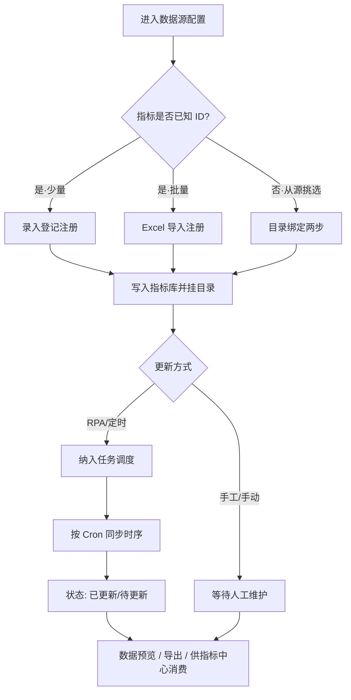
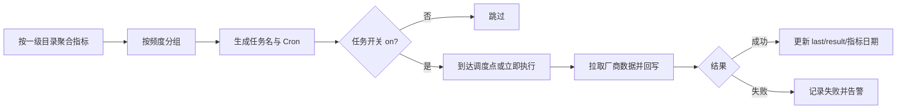
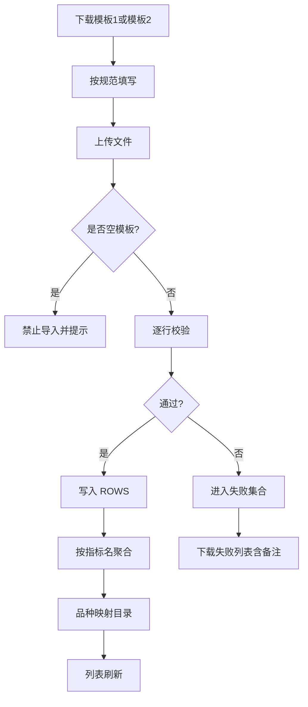
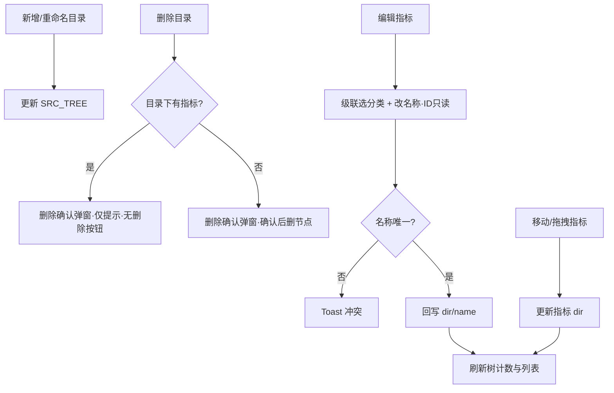

# AILab AI指标工坊 · 数据源模块产品需求文档

| 项目 | 说明 |
|------|------|
| 产品名称 | AILab AI指标工坊 |
| 模块名称 | 数据源管理 |
| 文档版本 | V1.2 |
| 文档日期 | 2026-08-12 |
| 适用范围 | 同花顺（iFinD）、上海钢联（Mysteel）、SMM、手工录入 |
| 关联页面 | `data-source.html`、`manual-data.html`；下游消费：指标中心、图库 |

---

## 1. 文档说明

### 1.1 编写目的

明确数据源模块的需求边界、交互规则、业务逻辑与端到端流程，作为产品、设计、研发、测试的统一依据。

### 1.2 产品定位

数据源模块是投研指标数据的**接入与治理入口**，负责：

1. 对接外部数据厂商（同花顺 / 上海钢联 / SMM）的指标目录、注册、绑定与定时同步；
2. 支持内部团队通过**手工录入 / Excel 导入**补齐厂商未覆盖或需人工维护的数据；
3. 将规范化后的指标供「指标中心」「图库」等下游模块消费。

### 1.3 用户角色

| 角色 | 典型诉求 |
|------|----------|
| 投研分析师 | 浏览目录、预览序列、导出、手工补数 |
| 数据管理员 | 目录治理、指标登记/绑定、任务调度、导入校验 |
| 系统管理员 | 数据源启停、收藏、权限（后续扩展） |

---

## 2. 需求列表

### 2.1 需求总览

| 需求 ID | 模块 | 需求名称 | 优先级 | 说明 |
|---------|------|----------|--------|------|
| DS-01 | 数据源总览 | 侧边栏数据源导航 | P0 | 展开「数据源」子菜单：上海钢联 / 同花顺 / SMM / 手工录入数据 |
| DS-02 | 数据源总览 | 数据源列表与收藏 | P1 | 展示名称、分类、关联表数量、收藏星标、进入配置 |
| DS-03 | 三源配置 | 目录树管理 | P0 | 最多 6 级目录浏览、搜索、行内增删改、折叠；与指标中心操作区一致 |
| DS-04 | 三源配置 | 指标列表与筛选 | P0 | 按目录展示指标；支持搜索、创建人、只看我的；列表操作列可编辑 |
| DS-05 | 三源配置 | 数据预览 | P0 | 按频度切换，以指标为列预览时间序列 |
| DS-06 | 三源配置 | 指标登记注册 | P0 | 录入登记 + Excel 批量注册 |
| DS-07 | 三源配置 | 目录绑定 | P0 | 从可选池勾选指标 → 确认字段 → 绑定目标目录 |
| DS-08 | 三源配置 | 任务调度 | P0 | 底部抽屉；配置状态/触发方式等筛选；系统默认调度与自动调度；可视化配置；开关启停；立即执行/暂停同位切换；居中日志 |
| DS-09 | 三源配置 | 指标编辑与移动 | P1 | 编辑弹窗改所属分类/ID/名称；拖拽、批量移动 |
| DS-10 | 三源配置 | 指标导出 | P1 | 按当前目录导出 Excel（厂商标签差异化） |
| MD-01 | 手工录入 | 目录与指标管理 | P0 | 目录树 + 指标聚合列表（ID/频度/单位/最新值等） |
| MD-02 | 手工录入 | Excel 导入 | P0 | 模板1/模板2 下载、上传预览、失败列表 |
| MD-03 | 手工录入 | 在线录入 | P0 | 按模板1字段网格填写并保存到库 |
| MD-04 | 手工录入 | 批量加入指标库 | P1 | 两步弹窗（对齐目录绑定）：选指标 → 确认名称/单位/频度/目录 → 加入指标中心 |
| MD-05 | 手工录入 | 批量导出 | P2 | 工具栏「导出 excel」按当前筛选导出（列表不再提供单行下载） |

### 2.2 数据源差异需求

| 需求 ID | 数据源 | 分类标签 | 导出场商标签 | 目录结构要点 | 指标来源登记选项 |
|---------|--------|----------|--------------|--------------|------------------|
| SRC-GL | 上海钢联 | 行业数据 | Mysteel | 预置多为两级（黑色建材、能源化工、原油…），最多可扩至 6 级 | 钢联数据 |
| SRC-THS | 同花顺 | 金融市场 | iFinD | 行情数据（股票/基金）、财务指标、宏观数据；最多 6 级 | 同花顺数据 |
| SRC-SMM | SMM | 行业数据 | Smm | 有色金属、基本金属、新能源等；最多 6 级 | SMM数据 |
| SRC-MD | 手工录入 | — | — | 对齐指标中心目录（黑色建材、能源化工、农产品、中国宏观等） | 手工 |

> **边界说明**：指标中心可展示更多来源（交易所等），但数据源配置页**当前仅对接上海钢联、同花顺、SMM** 三源；手工录入为独立能力入口。

### 2.3 非功能需求（建议）

| 编号 | 类型 | 要求 |
|------|------|------|
| NFR-01 | 权限 | 目录增删、任务启停、批量注册需数据管理员权限 |
| NFR-02 | 审计 | 登记/绑定/导入/同步需保留操作人、时间、结果 |
| NFR-03 | 幂等 | 同一指标 ID 重复注册应提示冲突，不允许静默覆盖时序 |
| NFR-04 | 性能 | 单次 Excel 导入建议 ≤ 1 万行；预览分页加载 |
| NFR-05 | 可用性 | 关键操作 Toast 反馈；导入失败可下载失败列表 |

---

## 3. 信息架构与入口

```
侧边栏 · 数据源
├── 上海钢联     → 三源配置页（?src=上海钢联）
├── 同花顺       → 三源配置页（?src=同花顺）
├── SMM          → 三源配置页（?src=SMM）
└── 手工录入数据 → 手工录入页（?view=manual / iframe）
```

**面包屑：**

- 三源：`数据源 / {源名}配置`
- 手工：`数据源 / 手工录入数据`

**配置页布局：**

| 区域 | 内容 |
|------|------|
| 左 | 目录树（搜索、最多 6 级、行内「＋」/操作、添加一级目录、折叠） |
| 右上 | 分段：指标数据 / 数据预览；搜索、创建人筛选、只看我的 |
| 右上操作 | 任务调度、指标登记注册、目录绑定 |
| 右下 | 指标表格 或 预览矩阵；频度切换条 |

---

## 4. 需求交互说明

### 4.1 三源配置 · 公共交互

#### 4.1.1 目录树

| 操作 | 交互说明 |
|------|----------|
| 展开/收起 | 点击节点箭头；子级默认展示短名（去掉父路径前缀） |
| 选中目录 | 高亮当前目录；右侧刷新该目录下指标 |
| 搜索 | 匹配目录名或指标名，过滤树节点 |
| 深度限制 | **最多 6 级**；第 6 级不展示「添加子目录」；尝试再下挂时 Toast 拦截 |
| 添加一级目录 | 底部「添加一级目录」→ 弹窗输入名称（≤20 字）→ 保存 |
| 添加子目录 | 与指标中心一致：行悬停/选中时，操作区左侧出现「＋」→ 弹窗输入名称 → 挂到当前节点下（路径 `父/子`）；子目录与指标可同挂于同一父节点 |
| 行内操作 | 悬停/选中显示：移动 / 编辑（重命名）/ 删除；「＋」在操作图标组左侧 |
| 重命名 | 「编辑」→ 弹窗改名 → 同步更新该目录下指标的 `dir` |
| 删除目录 | 打开**删除确认弹窗**（非浏览器 `confirm`）：空目录可确认删除；目录下仍有指标时仅提示「请先移出或删除指标」，隐藏「删除」按钮 |
| 折叠面板 | 点击折叠按钮收起/展开左侧目录区 |

#### 4.1.2 指标列表

| 列/操作 | 交互说明 |
|---------|----------|
| 展示字段 | 指标 ID、名称、来源（RPA/手工）、更新方式、最新日期、状态、创建人、部门、收藏、**操作** |
| 搜索 | 按 ID / 名称模糊过滤 |
| 创建人 | 下拉筛选 |
| 只看我的 | 仅展示当前用户创建的指标 |
| 收藏 | 星标切换 |
| 编辑 | 操作列「编辑」或树叶子行「编辑」→ 打开编辑指标弹窗（见 4.1.2a）；点击编辑不进入数据预览 |
| 删除 | 确认后从当前源指标库移除 |
| 拖拽移动 | 按住行拖到目录树目标节点；或打开「批量移动」 |

#### 4.1.2a 编辑指标弹窗

**入口：** 列表操作列「编辑」；左侧目录树指标叶子行「编辑」图标。

| 项 | 说明 |
|----|------|
| 标题栏 | 实心主色蓝底，文案「编辑指标」 |
| 所属分类 | **级联选择器（Cascader）**：按目录树多列展开（最多随 6 级）；触发器展示 `一级 / 二级 / …`；选中叶子可勾选收起；写入隐藏字段为完整路径；弹层限制最大宽高并在列内滚动，避免目录过深撑破弹窗 |
| 指标 ID | **只读（灰度禁用）**：展示原 ID，置灰不可改 |
| 指标名称 | 必填；当前源内不可与其他指标重复 |
| 保存 | 回写 `dir` / `name`（不改 `id`）；展开目标路径；刷新树与列表；Toast「已保存指标…」 |
| 取消 / Esc | 关闭不落库；级联面板打开时 Esc 优先收起面板 |

#### 4.1.3 数据预览

| 操作 | 交互说明 |
|------|----------|
| 切换至「数据预览」 | 右侧改为「日期 × 指标」矩阵 |
| 频度条 | 日度 / 周度 / 旬度 / 月度 / 季度 / 半年度 / 年度；切换后按频度生成/加载序列 |
| 空态 | 当前目录无指标时展示空状态引导 |

#### 4.1.4 指标登记注册

**入口：** 配置页「指标登记注册」→ 选择方式卡片。

**方式 A：录入登记注册**

1. 打开表格表单，可一次多行；
2. 字段：指标 ID、指标名称、所属目录、单位、频度、指标来源；
3. 指标来源下拉：`钢联数据 / 同花顺数据 / SMM数据 / 手工`；
4. 「保存登记」→ 写入当前数据源指标库；来源为「手工」时更新方式=手动更新，否则=定时更新（RPA）。

**方式 B：Excel 导入注册**

1. 在方式选择页或导入弹层下载「**数据登记注册 Excel 模板**」（文件名：`数据登记注册模板.xlsx`；列：指标ID / 指标名称 / 所属目录 / 单位 / 频度 / 指标来源）；
2. 上传文件 → 解析预览（条数提示）；
3. 「确认注册」→ 批量入库；失败行需可回看（正式版应支持失败导出）。

#### 4.1.5 目录绑定（两步）

```
步骤1 勾选指标  →  步骤2 确认绑定
```

| 步骤 | 交互 |
|------|------|
| 1 | 从可选指标池筛选（关键词、频度），勾选多条 →「下一步」 |
| 2 | 可编辑名称 / 单位 / 频度；目标目录用**级联选择器**（「分目录 / 同目录」）；弹层限制宽高并列内滚动 →「确认绑定」 |
| 返回 | 「上一步」回到勾选；取消关闭弹窗不落库 |

#### 4.1.6 任务调度

| 操作 | 交互 |
|------|------|
| 打开 | 「任务调度」打开**底部抽屉**（约 90vh），背景模糊；三源共用同一套 UI |
| 筛选 | 搜索 + **调度分类** + **执行时间** + **配置状态**（已配置/未配置）+ **触发方式** + **状态**（已启动/已暂停/上次成功/失败） |
| 字段 | 任务名称、调度分类、关联指标、调度时间、**配置状态**、**触发方式**、上次执行、结果、状态（开关）、修改人、操作 |
| 触发方式 | 仅两种：**系统默认调度**（未配置）/ **自动调度**（已配置）；**不含「手动执行」** |
| 未配置 | 调度时间文案为「**按照系统调度执行**」；结果为「—」；开关禁用；不可立即执行 |
| 配置调度 | 编辑图标或点击调度文案 → **基础配置 / 高级配置**：基础=频率 +（每周多选星期；旬/月下拉多选日；季/半年/年联动多选月+日）+ 多时刻；高级=规则配置 + **失败重跑（默认 3 次 / 间隔 5 分钟）** + Cron；首次保存后触发方式变为自动调度 |
| 状态 | **仅开关**，无右侧文案；控制是否参与自动调度；执行中不可切换 |
| 操作 | **编辑**（未配置/已配置图标区分）+ **立即执行 / 暂停同一位置切换**（空闲→立即执行，执行中→暂停）+ **执行日志** |
| 执行日志 | 点击关联指标或日志图标 → **居中弹窗表**：执行时间（`yyyy-mm-dd HH:mm:ss`）、触发方式、是否成功、耗时、备注 |

**默认定时规则（产品约定）：**

| 频度 | 调度文案 |
|------|----------|
| 日度 | 每日 08:00 |
| 周度 | 每周一 07:00（可多选星期） |
| 旬度 | 每旬 09:00（系统旬日 1/11/21，用户不选具体日期） |
| 月度 | 每月 1 日 08:30 |
| 季度 | 每季 08:00（系统季度节点） |
| 半年度 | 每半年 08:00（系统节点） |
| 年度 | 每年 08:00（系统节点） |

任务命名约定：`{一级目录}·{频度}同步`（例：`黑色建材·日度同步`）。

#### 4.1.7 批量移动

1. 打开弹窗，展示当前目录指标，支持全选；
2. 「移动到」使用**级联选择器**选目标目录（弹层限制宽高，避免目录过深撑破）；
3. 确认后批量更新 `dir` 并刷新树计数。

---

### 4.2 上海钢联（Mysteel）专项交互

| 项 | 说明 |
|----|------|
| 默认收藏 | 是 |
| 目录深度 | 预置多为两级（如 `黑色建材/螺纹钢`）；支持继续下挂，**最多 6 级**；指标挂在所选目录路径上 |
| 典型指标命名 | `品种:规格:价格类型:地区`，如 `螺纹钢:HRB400E:Φ18:市场价:上海` |
| 预置品类 | 黑色建材、能化、原油、基差、农产品、宏观、农林牧渔等 |
| 导出表头厂商名 | Mysteel |
| 关联虚拟表 | AAA/BBB/CCC/DDD：上海钢联（列表页展示用） |

**关键路径示例：**

1. 侧栏进入「上海钢联」；
2. 展开「黑色建材」→ 选「螺纹钢」；
3. 查看 RPA 定时更新的现货价指标；
4. 需要补库外指标 →「指标登记注册」或「目录绑定」；
5. 「任务调度」确认「黑色建材·日度同步」已开启。

---

### 4.3 同花顺（iFinD）专项交互

| 项 | 说明 |
|----|------|
| 默认收藏 | 是 |
| 分类 | 金融市场 |
| 目录 | 行情数据（股票行情、基金行情）、财务指标、宏观数据；部分为一级叶子 |
| 典型指标 | 收盘价/成交量/PE/PB/总市值/换手率等金融字段 |
| 导出表头厂商名 | iFinD |
| 与指标中心关系 | 指标中心「添加指标」默认数据来源建议为「同花顺 / 经济数据库」 |

**关键路径示例：**

1. 进入「同花顺」配置；
2. 选「行情数据 / 股票行情」浏览指标；
3. 预览切换「日度」查看收盘价序列；
4. 通过登记注册补充已知 iFinD 指标 ID。

---

### 4.4 SMM 专项交互

| 项 | 说明 |
|----|------|
| 默认收藏 | 否（可手动收藏） |
| 目录 | 有色金属（沪铜/沪锌）、基本金属（铝铅镍锡）、新能源（碳酸锂） |
| 典型指标 | 现货价、升贴水、库存、碳酸锂电池级/工业级现货价 |
| 导出表头厂商名 | Smm |

**关键路径示例：**

1. 进入「SMM」→「有色金属 / 沪铜」；
2. 绑定或登记升贴水类指标；
3. 开启「有色金属·日度同步」任务。

---

### 4.5 手工录入交互

#### 4.5.1 列表与筛选

| 操作 | 说明 |
|------|------|
| 目录树 | 顶满左侧（与右侧内容区并排顶对齐）；支持增删改目录 |
| 右侧工具栏 | 导入 / 批量加入指标库 / 批量删除 / 导出靠右排列（**不含**表头上方「只看我的」） |
| 表格列 | 指标 ID、名称、所属目录、单位、创建人、最新日期、最新值（**无单行下载列**） |
| 筛选 | 左侧目录区「只看我的」；列表侧无重复开关 |
| 批量删除 | 列表勾选后删除 |
| 导出 | 工具栏「导出 excel」按当前筛选结果导出 |
| 弹窗蒙层 | 全屏遮罩（嵌入 iframe 时抬升覆盖侧栏/顶栏） |

#### 4.5.1a 批量加入指标库（两步，对齐三源目录绑定）

**入口：** 工具栏「批量加入指标库」（不必先勾选列表；若列表已勾选则作为弹窗预选）。

| 步骤 | 交互 |
|------|------|
| 1 选择指标 | 从手工指标池勾选（过滤已加入项）；支持目录 / 频度 / 关键词筛选、「列表全选」、已选计数 |
| 2 确认加入 | 可编辑名称 / 单位 / 频度；「分目录 / 同目录」+ 目标目录**级联选择**（弹层限制宽高）→「确认加入」 |
| 返回 | 「上一步」回到勾选；取消关闭不落库 |

**结果：** 写入指标中心（来源标记「手工」）；同步回写手工库的目录与元数据；Toast 提示条数与目标目录。已加入的指标不再出现在步骤 1 可选池。

#### 4.5.2 Excel 导入（三步）

**导入弹窗布局：** 上方为「导入数据」主操作；下方为「下载导入模板」（模板1/2）。解析成功后**另开「导入预览」弹窗**，不在导入弹窗内嵌预览表。

| 步骤 | 用户动作 | 系统反馈 |
|------|----------|----------|
| 1 | 点击「导入数据」上传已填模板（可先在下方下载模板1/2） | 解析成功 → 关闭导入弹窗，打开独立「导入预览」；空模板不允许导入 |
| 2 | 在预览弹窗核对明细 | 展示文件名、条数、指标数与行表 |
| 3 | 确认导入 | 成功行入库；结果展示在预览弹窗；失败行可下载「导入失败列表」 |

**模板说明：**

| 模板 | 形态 | 字段 |
|------|------|------|
| 模板1 | 行式 | 品种、指标名称、指标日期、值、频度、单位 |
| 模板2 | 宽表 | 元数据行（品种/名称/单位/频度）+ 日期横轴数值列 |

#### 4.5.3 在线录入

1. 打开「在线录入」网格（字段同模板1）；
2. 多行填写，空行忽略；
3. 「保存到库」→ 校验通过后写入；失败行提示原因。

频度可选：日度 / 周度 / 月度 / 季度 / 年度。

---

## 5. 逻辑说明

### 5.1 核心对象模型

#### 5.1.1 数据源（DataSource）

| 字段 | 说明 |
|------|------|
| name | 上海钢联 / 同花顺 / SMM |
| category | 行业数据 / 金融市场 |
| favorite | 是否收藏 |
| vendorLabel | 导出用：Mysteel / iFinD / Smm |
| tree | 目录树 SRC_TREE |
| indicators | 指标集合 IND_STORE[src] |

#### 5.1.2 目录（Directory）

| 字段 | 说明 |
|------|------|
| path | 完整路径，如 `黑色建材/螺纹钢`；一级则为节点名 |
| parent | 父路径；无 kids 时自身为叶子 |
| level | 1～6（`DIR_MAX_LEVEL = 6`） |
| kids | 子目录列表（字符串路径或 `{ n, kids }` 嵌套对象） |

**规则：**

- 目录深度不超过 6；第 6 级禁止再添加子目录。
- 同一父节点下可同时存在子目录与指标（添加子目录不得清空已有指标展示）。
- 指标挂载优先**叶子目录**（`preferLeafDir`）：若只选到一级且存在二级，自动落到该一级下第一个叶子。
- 删除目录：有指标时弹窗拦截（不可确认删除）；空目录二次确认后删除。

#### 5.1.3 指标（Indicator · 三源）

| 字段 | 类型/枚举 | 说明 |
|------|-----------|------|
| id | string | 如 IND0001 |
| name | string | 指标全名 |
| dir | string | 所属目录路径 |
| src | RPA / 手工 | 数据采集方式标签 |
| upd | 定时更新 / 手动更新 | 与 src 联动 |
| date | YYYY-MM-DD | 最新数据日期 |
| status | 已更新 / 待更新 | 同步状态 |
| fav | bool | 收藏 |
| creator / dept | string | 创建人 / 部门 |
| freq / unit | string | 频度 / 单位（登记与绑定时写入） |

**来源 → 更新方式映射：**

| 指标来源选项 | 内部 src | upd |
|--------------|----------|-----|
| 钢联数据 / 同花顺数据 / SMM数据 | RPA | 定时更新 |
| 手工 | 手工 | 手动更新 |

#### 5.1.4 手工点位与聚合（Manual）

**原始行 ROWS：**

`variety, name, date, value, freq, unit, creator, id?, dir?`

**聚合指标（按 name）：**

- 合并多日点位为 `points[{date,value}]`；
- `latestDate / latestVal` 取最大日期对应值；
- `dir = dir || mapVarietyToDir(variety)`；
- ID 规则：`MD` + 序号。

#### 5.1.5 同步任务（Task）

| 字段 | 说明 |
|------|------|
| name | `{一级目录}·{频度}同步` |
| dir / freq | 作用域 |
| inds / indTotal | 关联指标摘要与总数 |
| cron | 调度文案 |
| last / result | 上次执行时间与成功/失败 |
| on / running | 是否启用 / 是否执行中 |

**生成逻辑：** 按一级目录聚合其下（含二级）指标，再按频度分组，每组一条任务。

### 5.2 品种 → 目录映射（手工）

| 品种输入 | 映射目录 |
|----------|----------|
| 「宏观」或含「宏观」 | 中国宏观 |
| 精确匹配一级名 | 该一级 |
| 匹配某一级下二级名 | `一级/二级` |
| 未知品种 | 新建同名一级目录并挂载 |

### 5.3 校验规则

#### 5.3.1 手工行校验 `validateRow`

| 条件 | 错误提示 |
|------|----------|
| dir 与 variety 皆空 | 所属目录/品种不能为空 |
| name 空 | 指标名称不能为空 |
| date 空 | 指标日期不能为空 |
| date 非 `YYYY-MM-DD` | 日期格式须为 YYYY-MM-DD |
| value 空或非数字 | 值不能为空且须为数字 |
| freq 空 | 频度不能为空 |
| unit 空 | 单位不能为空 |

附加规则：

- 空模板不允许导入；
- 在线录入空行忽略；
- 字段均为必填（产品文案约定）。

#### 5.3.2 三源登记 / 绑定（产品约束）

| 规则 | 说明 |
|------|------|
| 指标 ID 唯一 | 同数据源内不可重复；冲突提示「已存在」 |
| 所属目录必选叶子 | 禁止只绑到仍有二级的一级节点 |
| 频度枚举 | 日度/周度/旬度/月度/季度/半年度/年度（预览与任务对齐） |
| 名称必填 | 绑定步骤2可改名，但不能为空 |

### 5.4 数据预览序列逻辑

- 输入：当前目录指标列表 + 选中频度；
- 输出：以日期为行、指标为列的矩阵；
- 正式版：按指标真实时序对齐日期轴；缺失按下游「空值策略」处理（与图表模块一致时可复用：跨过 / 前值 / 0 等）。

### 5.5 导出逻辑

| 场景 | 文件名建议 | 内容 |
|------|------------|------|
| 三源目录导出 | `{目录简称}{yy.mm.dd}.xlsx` | 序列数据；表头含厂商名 |
| 手工失败列表 | 失败列表.xlsx | 原字段 + 备注/Note |
| 手工批量导出 | `手工录入数据导出.xlsx` | 当前筛选指标汇总列 |

非法文件名字符 `\/:*?"<>|` 替换为 `_`。

### 5.6 与下游模块衔接

```
外部厂商 API / RPA          手工 Excel / 在线录入
         │                         │
         ▼                         ▼
   数据源配置（注册/绑定/调度）   手工录入库
         │                         │
         └──────────┬──────────────┘
                    ▼
              指标中心（指标库）
                    ▼
           图库 / 图表构建 / 研报
```

| 衔接点 | 逻辑 |
|--------|------|
| 批量加入指标库 | 两步弹窗（同目录绑定交互）确认后，手工指标写入指标中心，来源标记「手工」 |
| 添加指标默认源 | 指标中心默认「同花顺」 |
| 重名检测 | 指标中心添加时若库内已存在，提示名称与目录并阻止重复添加 |

---

## 6. 相关流程

### 6.1 三源指标接入主流程



### 6.2 任务调度流程



### 6.3 手工导入流程



### 6.4 目录治理与指标编辑流程



### 6.5 端到端业务场景（示例）

**场景 A：钢联螺纹钢日度价自动入库**

1. 管理员在上海钢联下确认目录 `黑色建材/螺纹钢`；
2. 通过目录绑定勾选「螺纹钢上海市场价」等指标并确认单位=元/吨、频度=日度；
3. 开启任务「黑色建材·日度同步」；
4. 每日 08:00 RPA/API 回写最新价；状态「已更新」；
5. 分析师在指标中心/图库使用该指标绘图。

**场景 B：宏观手工补数**

1. 分析师进入「手工录入数据」；
2. 下载模板1，填写品种=宏观、指标名、日期、值、频度、单位；
3. 上传确认；失败行下载失败列表修正后重导；
4. 映射至「中国宏观」；「批量加入指标库」两步确认目录与元数据后推送指标中心；
5. 后续可用在线录入追加新日期点。

**场景 C：同花顺金融指标登记**

1. 从 iFinD 获取指标 ID；
2. 在同花顺配置页「录入登记注册」填写 ID、目录、单位、频度、来源=同花顺数据；
3. 保存后纳入对应频度同步任务。

---

## 7. 界面与状态一览

### 7.1 三源配置页状态

| 状态 | 表现 |
|------|------|
| 目录空 | 右侧空态 + 引导登记/绑定 |
| 同步成功 | 状态「已更新」，最新日期刷新 |
| 同步失败 | 任务 result=失败；指标可保持「待更新」 |
| 无搜索结果 | 表格空行文案「未找到匹配…」 |

### 7.2 手工录入状态

| 状态 | 表现 |
|------|------|
| 预览待确认 | 「确认导入」可点；展示待导入行数 |
| 含失败行 | Toast 提示成功/失败条数；提供失败列表下载 |
| 仅失败 | 不写入成功库；仍可下载失败列表 |

---

## 8. 验收要点（测试清单）

### 8.1 三源

- [ ] 侧栏可分别进入三源与手工，面包屑正确
- [ ] 目录最多 6 级；第 6 级无「＋」；行悬停显示「＋」与移动/编辑/删除
- [ ] 有子目录的节点下若已有指标，两者同时展示不被清空
- [ ] 删除目录走确认弹窗：有指标不可删、空目录可确认删除
- [ ] 列表/树可打开「编辑指标」；级联分类 + 名称可改且唯一；指标 ID 置灰不可改
- [ ] 登记注册：手工来源→手动更新；厂商来源→定时更新
- [ ] Excel 注册预览条数与确认入库一致
- [ ] 目录绑定两步可前进/后退，绑定后出现在目标目录
- [ ] 任务按目录×频度生成；触发方式仅为系统默认调度/自动调度；开关启停与立即执行/暂停同位切换正确
- [ ] 未配置显示「按照系统调度执行」；筛选含配置状态与触发方式；执行日志为居中弹窗
- [ ] 登记入口可下载数据登记注册 Excel 模板
- [ ] 数据预览随频度切换
- [ ] 导出文件名含目录与日期，厂商标签正确（Mysteel/iFinD/Smm）

### 8.2 手工

- [ ] 导入弹窗上传置顶、模板置底；解析成功打开独立预览弹窗再确认入库
- [ ] 模板1/2 可下载；空模板不可导入
- [ ] 校验规则全部生效；失败列表含备注
- [ ] 品种「宏观」映射到「中国宏观」
- [ ] 同名多日点位聚合为一条指标，最新值正确
- [ ] 在线录入空行忽略，保存成功刷新列表
- [ ] 批量加入指标库为两步弹窗（选指标 → 确认目录/元数据），与三源目录绑定一致
- [ ] 列表无单行「下载」列；导出走工具栏「导出 excel」

---

## 9. 附录

### 9.1 上海钢联目录结构（摘要）

- 黑色建材：钢坯、铁合金、螺纹钢、线材、热卷、冷卷、中厚板、生铁/废钢、水泥、混凝土、短流程、原煤、焦煤、焦炭、铁矿石、原木、不锈钢、粗钢…
- 能源化工：PP、PE、PVC、苯乙烯、烧碱、纯苯、玻璃、纯碱、尿素、PTA、PX、甲醇、乙二醇、LNG、LPG、沥青、成品油、天然橡胶…
- 原油：价格、需求、贸易进出口、供应、库存
- 基差：价格、供应、需求、库存
- 农产品：棉类、油籽、饲料、油脂、养殖
- 中国宏观：中国经济数据
- 农林牧渔：糖类/红枣/桃类/苹果数据库

### 9.2 SMM 目录结构

- 有色金属：沪铜、沪锌
- 基本金属：铝、铅、镍、锡
- 新能源：碳酸锂

### 9.3 同花顺目录结构

- 行情数据：股票行情、基金行情
- 财务指标
- 宏观数据

### 9.4 术语表

| 术语 | 含义 |
|------|------|
| RPA | 机器人流程自动化采集，对应定时更新 |
| 指标登记注册 | 已知厂商指标 ID 时写入平台元数据 |
| 编辑指标 | 弹窗修改所属分类（级联）、指标名称；指标 ID 只读不可改 |
| 级联分类 | Cascader 多列选择目录路径，展示为 `A / B / C` |
| 目录绑定 | 从可选池挑选指标并挂到平台目录 |
| 叶子目录 | 无可再展开子节点的目录路径，指标常用挂载点 |
| 频度 | 时序粒度：日/周/旬/月/季/半年/年 |
| iFinD | 同花顺金融数据终端接口品牌名 |
| Mysteel | 上海钢联数据品牌名 |
| SMM | 上海有色网 |

### 9.5 原型与正式版差异（实现备注）

当前仓库为高保真前端原型，产品逻辑以上文为准；落地时需补齐：

- 真实厂商 API / 凭证 / 采集任务执行器；
- 服务端持久化、权限与审计；
- Excel 真实解析（非演示数据）；
- 与指标中心的统一指标主数据，避免双份 mock。

---

**文档结束**
