# AILab AI指标工坊 · 数据源模块（原型批注需求）

| 项目 | 说明 |
|------|------|
| 产品 | AILab AI指标工坊 |
| 模块 | 数据源 |
| 文档风格 | 原型截图 / 区域 → **需求说明** + **交互说明** |
| 版本 | V2.0（批注版） |
| 日期 | 2026-08-12 |
| 原型文件 | `data-source.html`、`manual-data.html` |
| 截图目录 | `docs/prd-screenshots/` |
| 范围 | 上海钢联、同花顺、SMM、手工录入数据 |
| 维护约定 | **原型（`data-source.html` / `manual-data.html`）功能变更时，须同步更新本文档（`.md` + `.html`）与相关截图** |

> 阅读方式：每张图下方用 **①②③…** 对应界面区域。  
> - **需求说明**：要解决什么问题、业务规则、约束与验收口径  
> - **交互说明**：点哪里、发生什么、即时反馈  
> 对象模型与校验枚举可对照 `数据源模块-产品需求文档.md`。

### V2.0 变更摘要

| 项 | 说明 |
|----|------|
| 触发方式 | 仅两种：**系统默认调度**（未配置）、**自动调度**（已配置）；删除「手动执行」 |
| 筛选扩展 | 增加 **配置状态**（已配置/未配置）、**触发方式** 筛选 |
| 未配置文案 | 调度时间显示「**按照系统调度执行**」 |
| 状态列 | 仅保留启停开关，**去掉开关右侧文案**（启动/暂停/执行中） |
| 操作列 | 图标化：编辑（未配置/已配置笔形区分）+ **立即执行 / 暂停同一位置切换** + 执行日志 |
| 执行日志 | 居中弹窗明细表（非侧栏）：执行时间、执行日期、触发方式、是否成功、耗时、备注 |
| 登记模板 | 指标登记入口可下载「**数据登记注册 Excel 模板**」；Excel 导入弹层同名下载 |
| 周期多选 | **每旬**下拉多选 1–30 日；**每月**下拉多选日/月末；**每季**季度月（季初/中/末）联动 + 日期多选；**每半年/每年**月份+日期多选 |

### V1.9 变更摘要

| 项 | 说明 |
|----|------|
| 星期多选 | 每周支持多选星期 1–7 |
| 周期不选具体日期 | **每旬 / 每季 / 每半年 / 每年** 仅设执行时间，由系统节点调度；**每月**仍选执行日 |
| 去掉修改人 | 配置弹层不再填写修改人（列表修改人仍由系统记录当前用户） |
| 失败重跑 | 高级配置：默认失败重跑 **3 次**、间隔 **5 分钟**（可改） |

### V1.8 变更摘要

| 项 | 说明 |
|----|------|
| 调度配置结构 | 对齐有数 BI 推送任务：**基础配置** / **高级配置** 双 Tab |
| 基础配置 | 执行频率 + 随频率的日期/星期 + 执行时间 |
| 高级配置 | **规则配置** + Cron |

### V1.7 变更摘要

| 项 | 说明 |
|----|------|
| 频率配置拆分 | **每天**：仅多时刻；**每周**：先选星期 1–7，再选时刻；**每旬/每月**：日历日多选 + 时刻；**每季/半年/每年**：日期选择器多选 + 时刻 |

### V1.6 变更摘要

| 项 | 说明 |
|----|------|
| 频率联动 | 「执行频率」下拉与下方日期面板联动：每天仅时刻；每周星期；每旬旬日；月/季/半年/年多选日期 |
| 多时刻 | 取消「每天最多 8 个时刻」限制，可任意添加 |
| 列表字段 | 去掉「关联目录」；新增「修改人」；配置弹层可填修改人并写入日志 |
| 指标日志 | 关联指标可点击，打开右侧日志抽屉查看该任务/指标相关记录 |

### V1.5 变更摘要

| 项 | 说明 |
|----|------|
| 品牌 | 全局侧栏由 ETA 替换为 **AILab · AI指标工坊** |
| 调度配置增强 | 月/季/半年/年支持**多选日期**（1–31 日 + 月末），并保留多时刻；提供 1 日 / 月末 / 1,15 / 旬度 快捷项 |

### V1.4 变更摘要

| 项 | 说明 |
|----|------|
| 任务调度容器 | 居中弹窗改为**底部抽屉**（约 90vh），全屏遮罩 + 背景模糊；三源共用 |
| 筛选 | 「调度分类 / 执行时间 / 状态」收拢为三个筛选按钮；支持上次执行日期区间 |
| 调度配置 | 可视化配置替代纯文案 Cron：频率下拉（每天/周/旬/月/季/半年/年）+ 多时刻；每天最多 8 个时刻 |
| （沿用 V1.3）文档结构 | 需求说明 + 交互说明双栏 |
| （沿用 V1.2）级联选择 | Cascader / portal |

### V1.3 变更摘要

| 项 | 说明 |
|----|------|
| 文档结构 | 区域批注表增加「需求说明」列，与「交互说明」并列 |
| （沿用 V1.2）级联选择 | 编辑 / 登记 / 绑定步骤2 / 批量移动 / 手工批量加入 统一 Cascader |
| （沿用 V1.2）弹层 | 限宽高、列内滚动；表格内可 portal 防裁切 |

---

## 0. 范围与入口

```
侧边栏 · 数据源
├── 上海钢联     → 三源配置页（公共布局，目录/指标不同）
├── 同花顺       → 同上
├── SMM          → 同上
└── 手工录入数据 → 手工页（iframe 嵌入，支持 Excel 导入）
```

| 数据源 | 分类 | 导出场商标签 | 目录特点 |
|--------|------|--------------|----------|
| 上海钢联 | 行业数据 | Mysteel | 预置多为两级（如 `黑色建材/螺纹钢`）；可继续下挂，**最多 6 级** |
| 同花顺 | 金融市场 | iFinD | 行情/财务/宏观；部分一级即叶子；同样最多 6 级 |
| SMM | 行业数据 | Smm | 有色/基本金属/新能源；同样最多 6 级 |
| 手工录入 | — | — | 对齐指标中心目录；Excel / 在线补数 |

**不在本期：** 数据源总览列表页（原型已移除，菜单直达配置）；其他厂商源。

---

## 1. 三源配置页 · 总览（以钢联为例）

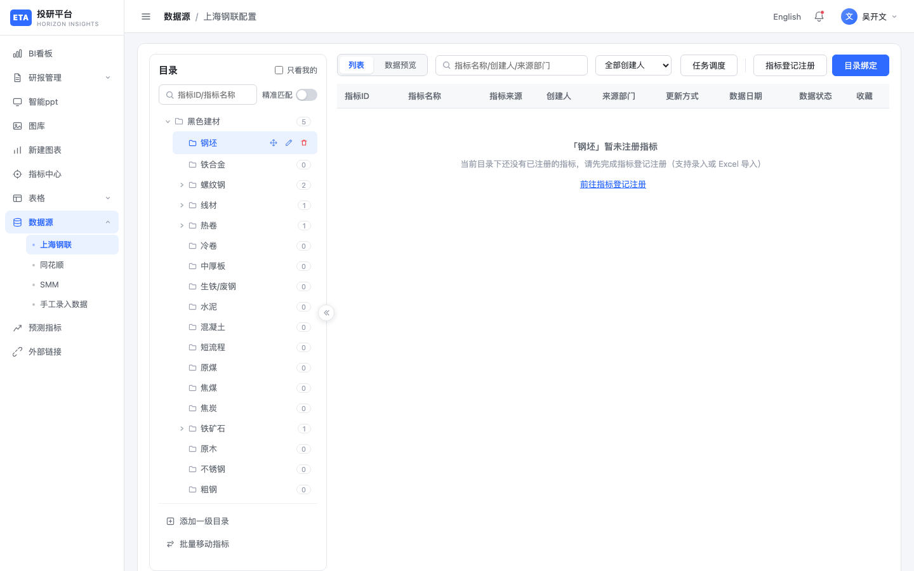

| 编号 | 区域 | 需求说明 | 交互说明 |
|------|------|----------|----------|
| ① | 侧栏「数据源」子菜单 | 四源独立入口，避免总览页二次跳转；当前源上下文决定目录树、任务与厂商标签 | 点击「上海钢联 / 同花顺 / SMM / 手工录入数据」切换；当前项高亮；面包屑为 `数据源 / {源名}配置` 或 `手工录入数据` |
| ② | 目录树 | 支撑多级业务分类（≤6 级）；角标反映目录下指标规模，便于治理与定位 | 展示目录与数量；点击刷新右侧；悬停/选中显示「＋」与移动/编辑/删除（对齐指标中心） |
| ③ | 目录搜索 + 精准匹配 | 在深目录中快速定位指标；精准模式用于 ID/全名核验，减少误命中 | 按指标 ID/名称过滤树；开启精准匹配则完全相等才命中 |
| ④ | 「只看我的」 | 个人工作台视角，过滤与当前用户相关的目录/指标 | 勾选后仅展示当前用户相关数据，与列表筛选联动 |
| ⑤ | 添加一级目录 / 批量移动指标 | 一级目录集中创建；子级在行内添加；批量移动支撑目录重组 | 底部：新增根目录或打开批量移动；子目录用行「＋」，不再用底部「添加二级」 |
| ⑥ | 列表 / 数据预览 | 元数据浏览与时序核验分离，降低单页信息密度 | 分段切换；列表看元数据，预览看时序明细 |
| ⑦ | 列表筛选 | 按名称/创建人/部门缩小范围，支撑协作检索 | 关键词 + 创建人下拉 |
| ⑧ | 任务调度 / 登记 / 绑定 | 三源核心作业入口：调度同步、登记已知 ID、从厂商池绑定 | 三个主按钮，分别进入 §3～§5 |
| ⑨ | 空态 | 空目录需可行动引导，降低「无数据不知如何继续」成本 | 提示无指标，并提供「前往指标登记注册」快捷链 |

**有数据时的列表态：**

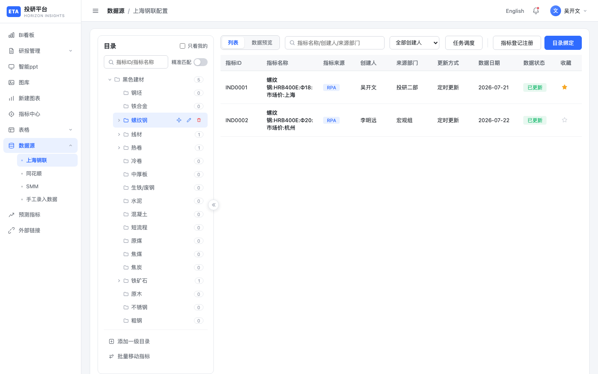

| 编号 | 区域 | 需求说明 | 交互说明 |
|------|------|----------|----------|
| ① | 指标表格 | 列表需覆盖标识、来源、责任人、更新与状态，支撑运维与编辑入口 | 列：指标ID、名称、来源、创建人、来源部门、更新方式、数据日期、数据状态、收藏、**操作** |
| ② | 来源标签 | 区分自动采集与人工维护，决定后续更新预期 | 展示 RPA / 手工（或厂商标签）；RPA 通常对应「定时更新」 |
| ③ | 数据状态 | 标识是否已按任务更新，便于发现滞后指标 | 「已更新」（绿）/「待更新」（蓝） |
| ④ | 收藏星标 | 个人快捷关注，不影响他人视图 | 点击切换收藏 |
| ⑤ | 操作「编辑」 | 允许改分类与名称，禁止改 ID，保证下游引用稳定 | 打开编辑弹窗（§1.1）；点击编辑不进入数据预览 |
| ⑥ | 选中目录 | 绑定/登记后目录计数与列表范围一致 | 角标随绑定/登记变化；指标挂在所选路径（含多级叶子） |

### 1.1 编辑指标弹窗

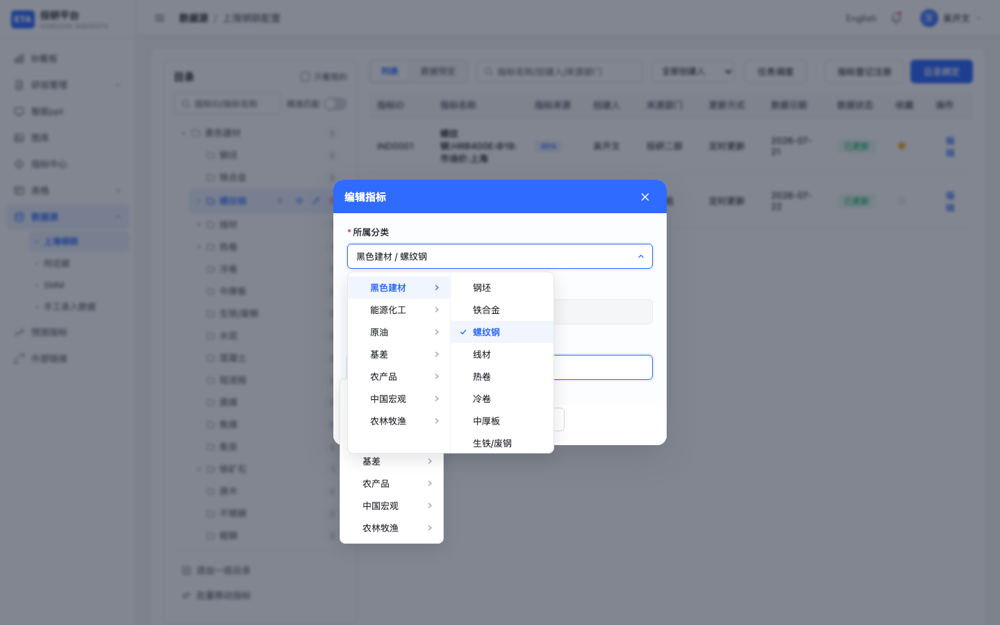

| 编号 | 区域 | 需求说明 | 交互说明 |
|------|------|----------|----------|
| ① | 入口 | 列表与树两处可改元数据，减少上下文切换 | 列表操作列「编辑」或树叶子行编辑图标 |
| ② | 标题栏 | 明确当前为编辑态，与新增/登记区分 | 实心蓝底「编辑指标」 |
| ③ | 所属分类 | 支持最多 6 级目录迁移；路径可读、可选叶子 | 级联多列展开；触发器展示 `原油 / 价格`；选叶子收起；弹层限宽高、列内滚动 |
| ④ | 指标 ID | **全局稳定主键，禁止修改**，避免绑定/任务/下游断链 | 置灰只读（灰度禁用） |
| ⑤ | 指标名称 | 业务可读名；同数据源内唯一，避免重名混淆 | 必填；同数据源不可重复 |
| ⑥ | 保存 / 取消 | 保存仅落库分类与名称；取消不产生副作用 | 保存后刷新；取消或 Esc 关闭不落库 |

---

## 2. 数据预览

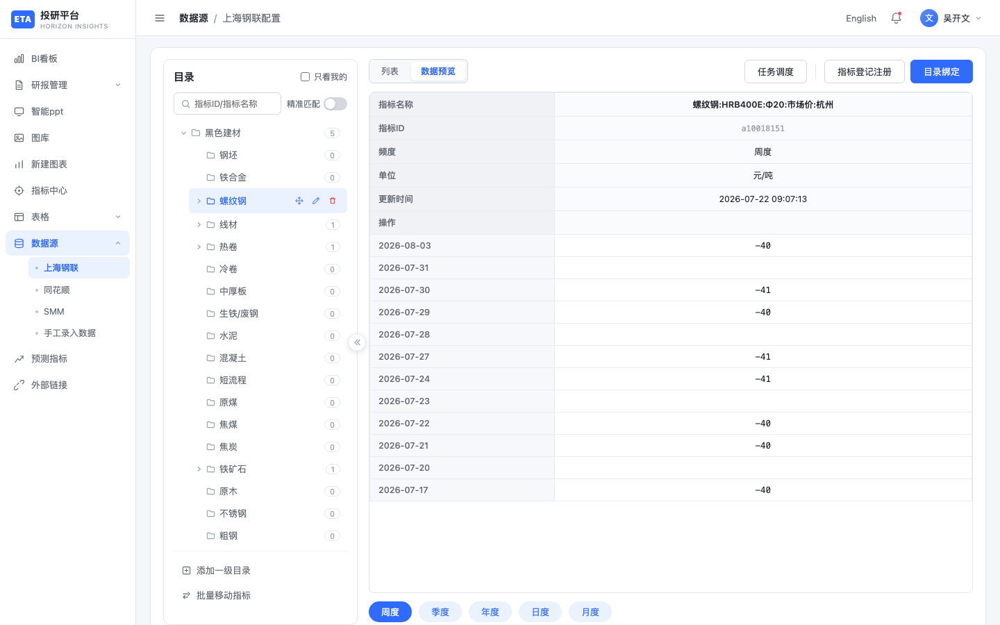

| 编号 | 区域 | 需求说明 | 交互说明 |
|------|------|----------|----------|
| ① | 「数据预览」页签 | 在配置页内核验时序质量，无需跳转外部工具 | 切换后右侧改为时序预览（非列表） |
| ② | 指标头信息 | 确认当前预览对象的身份与口径（频度/单位） | 展示名称、指标ID、频度、单位、更新时间 |
| ③ | 时序表 | 按日期查看数值，支撑抽样核对 | 日期 × 值；随当前选中指标加载 |
| ④ | 底部频度条 | 同一指标可能多频度序列，需按频度切换查看 | 周/季/年/日/月；切换后重载序列 |
| ⑤ | 空目录 | 无指标时不应展示伪数据 | 引导回登记/绑定，不展示有效序列 |

---

## 3. 任务调度

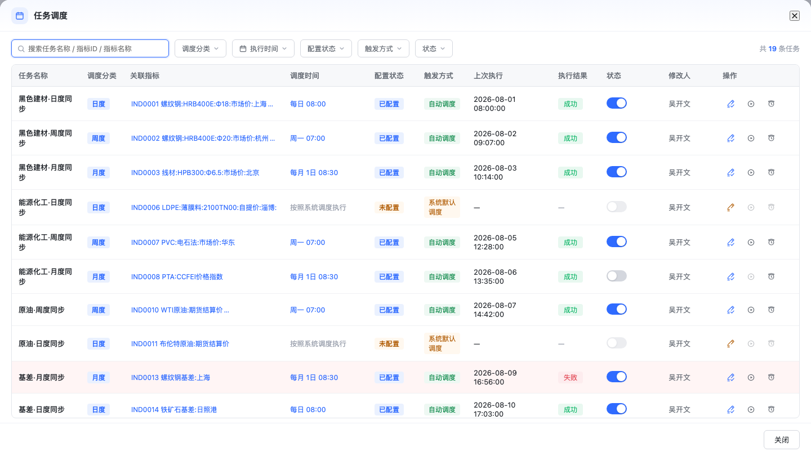

| 编号 | 区域 | 需求说明 | 交互说明 |
|------|------|----------|----------|
| ① | 入口「任务调度」 | 按数据源管理自动同步任务；三源（钢联 / 同花顺 / SMM）共用同一套 UI | 打开**底部抽屉**（约 90% 屏高），背景模糊；Esc / ✕ /「关闭」退出 |
| ② | 搜索 | 任务量大时按名称/指标定位 | 支持任务名称 / 指标ID / 指标名称 / 调度文案 / 触发方式 |
| ③ | 筛选按钮组 | 频度、配置、触发、时间、状态需可组合过滤 | **调度分类**、**执行时间**、**配置状态**（已配置/未配置）、**触发方式**（系统默认调度 / 自动调度）、**状态**（已启动/已暂停/上次成功/失败） |
| ④ | 任务行 | 运维识别任务、配置与触发方式、责任人 | 名称 `{目录}·{频度}同步`；调度分类、关联指标、调度时间、**配置状态**、**触发方式**、上次执行、结果、状态、修改人、操作 |
| ⑤ | 调度时间 | 未配置走系统默认；已配置可可视化改排期 | 未配置显示「**按照系统调度执行**」；点击文案或编辑图标 → 配置弹层；保存后变为已配置，触发方式为**自动调度** |
| ⑥ | 触发方式 | 仅区分系统默认与自定义自动调度，不另设「手动执行」态 | **系统默认调度**（未配置）/ **自动调度**（已配置）；立即执行不改变该字段枚举 |
| ⑦ | 执行结果 | 失败需可辨识，驱动排查 | 成功绿 / 失败红；失败行可浅红底；未配置结果为「—」 |
| ⑧ | 状态 | 控制是否参与自动调度 | **仅开关**，无右侧文案；未配置/执行中禁用；悬浮 tip 提示启动/暂停 |
| ⑨ | 操作 | 编辑配置、补跑与查日志；图标节省列宽 | **编辑**（未配置橙笔 / 已配置蓝笔+勾）→ 打开配置；**立即执行 / 暂停**同一位置：空闲显示立即执行，执行中切换为暂停；**执行日志**；未配置/未启动不可立即执行 |
| ⑩ | 执行日志 | 回溯近期执行与配置变更 | 点关联指标名或日志图标 → **居中弹窗表**；见下 |
| ⑪ | 关闭 | 浏览或操作后退出 | ✕ 或「关闭」；日志 / 配置弹层打开时 Esc 先关上层 |


| 编号 | 区域 | 需求说明 | 交互说明 |
|------|------|----------|----------|
| A | Tab | 对齐有数 BI：简单排期与规则分离 | **基础配置** / **高级配置**；默认进基础 |
| B | 执行频率 | 对应常见周期 | 下拉：每天 / 每周 / 每旬 / 每月 / 每季 / 每半年 / 每年 |
| C | 星期 / 日期 / 月份 | 按频率下拉多选 | 每周：多选星期；**每旬**：下拉多选 1–30 日；**每月**：下拉多选 1–31 日/月末；**每季**：季度月（季初/季中/季末联动）+ 日期多选；**每半年/每年**：月份 + 日期多选 |
| D | 执行时间 | 到点触发；支持同日多时刻 | 可添加多个 `HH:mm`，数量不限 |
| E | 调度预览 | 可读懂 | 实时文案；保存写回列表与日志（修改人记当前用户） |

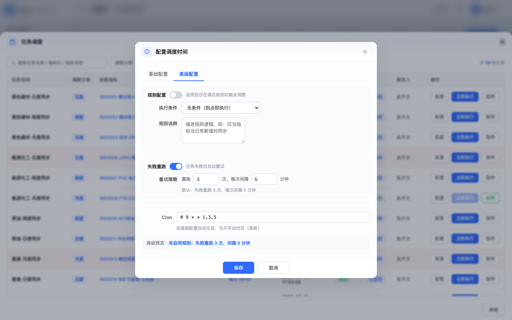

| 编号 | 区域 | 需求说明 | 交互说明 |
|------|------|----------|----------|
| F | 规则配置 | 到点之外再加执行条件 | 开关启用；条件：无条件 / 数据有更新 / 自定义；可填规则说明 |
| G | 失败重跑 | 失败后自动补跑，避免偶发失败丢同步 | 默认开启：重跑 **3** 次、间隔 **5** 分钟；可改次数与间隔，可关闭 |
| H | Cron | 给运维/高级用户直接改表达式 | 默认由基础配置生成；手动改写后保留 |
| I | 高级预览 | 确认规则与重跑策略 | 拼接规则状态与「失败重跑 n 次，间隔 m 分钟」 |

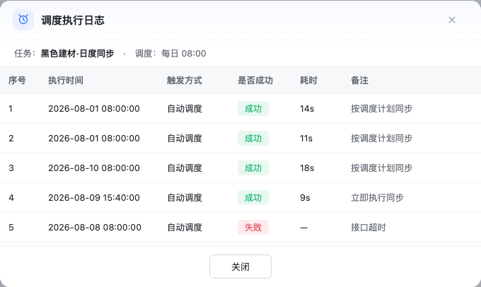

| 编号 | 区域 | 需求说明 | 交互说明 |
|------|------|----------|----------|
| L1 | 入口 | 从任务或指标维度查看执行轨迹 | 点击关联指标名，或操作列「执行日志」图标 |
| L2 | 容器 | 明细表需居中可读，避免侧栏过窄 | **居中弹窗**（非侧栏） |
| L3 | 日志列 | 覆盖执行时点、成败与触发来源 | 序号、**执行时间**（`yyyy-mm-dd HH:mm:ss`）、**触发方式**、是否成功、耗时、备注；失败标红 |

**触发方式枚举（任务列表 / 筛选）：** `系统默认调度` | `自动调度`（不含手动执行）。  
**默认定时（产品约定 · 基础配置）：** 日 08:00 · 周一 07:00 · 每旬 09:00 · 月 1 日 08:30 · 每季/半年/年 08:00。  
**默认失败重跑：** 3 次，间隔 5 分钟。

---

## 4. 指标登记注册

### 4.1 方式选择


| 编号 | 区域 | 需求说明 | 交互说明 |
|------|------|----------|----------|
| ① | 入口「指标登记注册」 | 已知厂商 ID 时登记入库，与「目录绑定」互补 | 先弹方式选择，不直接进表单 |
| ② | 录入登记注册 | 适合少量、已知 ID 的快速登记 | 进入表单 §4.2 |
| ③ | Excel导入注册 | 适合批量清单一次性注册 | 进入模板上传 §4.3 |
| ④ | 数据登记注册 Excel 模板 | 先下载模板填写，再导入，降低字段错误 | 入口说明区蓝链下载 `数据登记注册模板.xlsx`；与 §4.3 下载同源 |
| ⑤ | 取消 / ✕ | 未选择方式不产生数据 | 关闭，不落库 |

### 4.2 录入登记

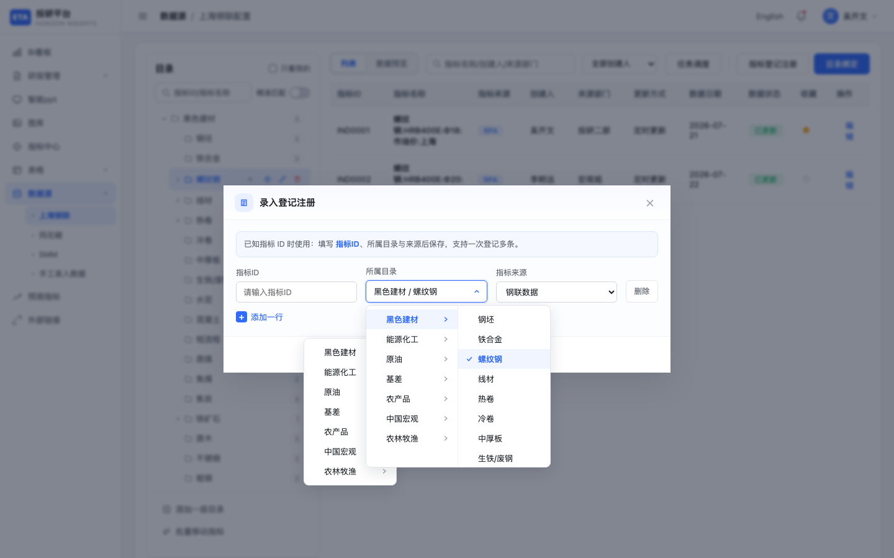

| 编号 | 区域 | 需求说明 | 交互说明 |
|------|------|----------|----------|
| ① | 行字段 | 一条登记至少含 ID、目录、来源，才能进入后续调度/消费 | 指标ID（必填）、所属目录、指标来源 |
| ② | 所属目录 | 必须落到平台目录叶子（或约定可挂节点）；支持深路径 | **级联选择器**（默认当前叶子）；触发器展示 `黑色建材 / 螺纹钢` |
| ③ | 指标来源 | 来源决定更新方式：厂商→定时(RPA)，手工→手动 | 下拉钢联/同花顺/SMM/手工并映射更新方式 |
| ④ | 删除行 | 允许修正误填行 | 去掉当前行 |
| ⑤ | + 添加一行 | 一次提交多条，提高录入效率 | 每行独立级联目录 |
| ⑥ | 保存登记 | 同 ID 禁止静默覆盖，保证数据完整性 | 写入当前源指标库；冲突提示 |
| ⑦ | 取消 | 放弃本次录入 | 关闭不保存 |

### 4.3 Excel 导入注册

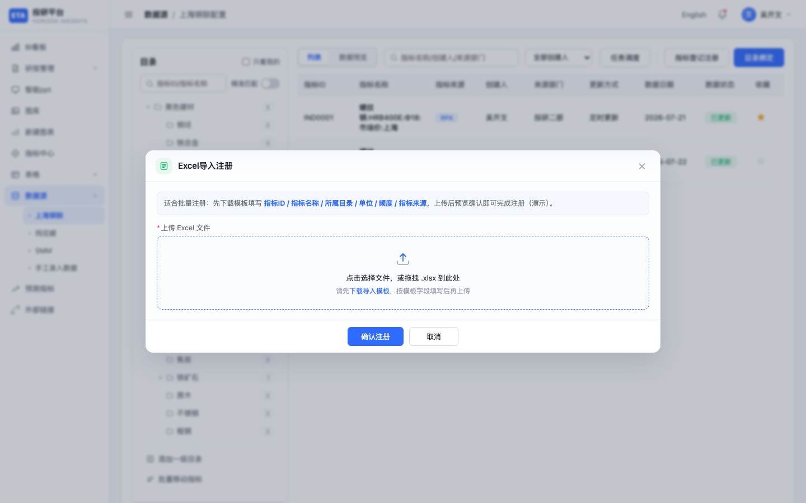

| 编号 | 区域 | 需求说明 | 交互说明 |
|------|------|----------|----------|
| ① | 说明条 | 明确模板字段，降低导入失败率 | 指标ID / 名称 / 目录 / 单位 / 频度 / 来源 |
| ② | 上传区 | 仅接受约定模板结构的 `.xlsx` | 点击或拖拽上传；须先下载模板 |
| ③ | 下载数据登记注册 Excel 模板 | 标准模板是批量注册前置条件 | 蓝链「下载数据登记注册 Excel 模板」→ `数据登记注册模板.xlsx` |
| ④ | 确认注册 | 预览后入库；空模板不允许；失败可追溯 | 解析预览后批量入库；正式版支持失败导出 |
| ⑤ | 取消 | 放弃本次导入 | 关闭 |

---

## 5. 目录绑定（两步）

### 5.1 步骤1 · 选择指标

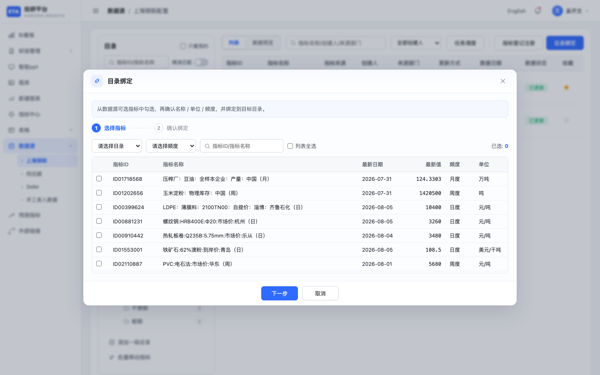

| 编号 | 区域 | 需求说明 | 交互说明 |
|------|------|----------|----------|
| ① | 入口「目录绑定」 | 从厂商可选池挑选指标挂到平台目录，形成可消费资产 | 打开两步绑定流程 |
| ② | 步骤条 | 分步降低一次勾选并改元数据的出错率 | 1 选择指标 → 2 确认绑定 |
| ③ | 筛选 | 在大池中按目录/频度/关键词缩小候选 | 目录、频度、关键词；「列表全选」；「已选: N」 |
| ④ | 可选池表格 | 勾选前需看到关键行情字段以便判断 | 指标ID、名称、最新日期、最新值、频度、单位 |
| ⑤ | 下一步 | 至少 1 条才进入确认，避免空绑定 | 未选可 Toast |
| ⑥ | 取消 | 中途退出不落库 | 关闭 |

### 5.2 步骤2 · 确认绑定

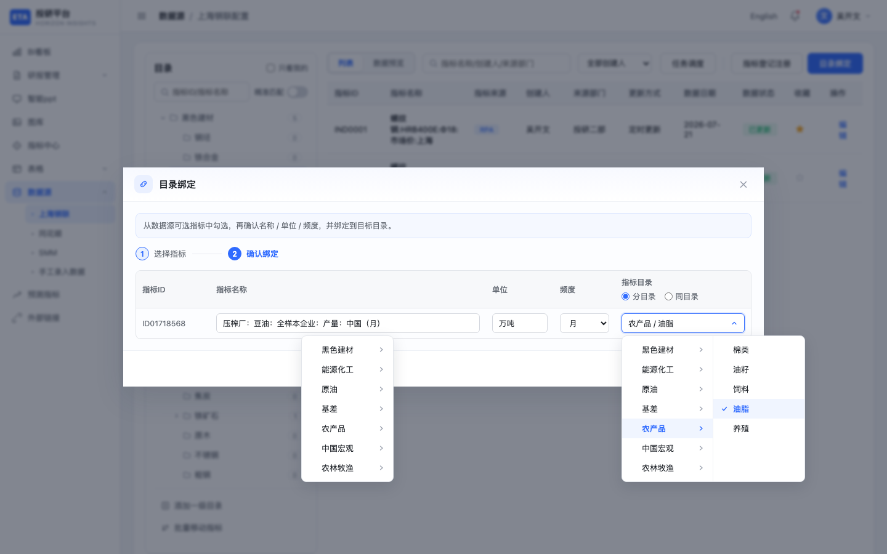

| 编号 | 区域 | 需求说明 | 交互说明 |
|------|------|----------|----------|
| ① | 步骤条 | 明确当前处于确认态 | 高亮「确认绑定」 |
| ② | 可编辑字段 | 绑定时允许校正展示名/单位/频度；ID 不可改 | 名称、单位、频度可改；指标ID 只读 |
| ③ | 目录策略 | 支持逐条分目录或整批同目录；目标须合法叶子路径 | 「分目录 / 同目录」+ **级联**；表格内 portal 防裁切 |
| ④ | 上一步 | 可回退改选，保留已选集合 | 回勾选页 |
| ⑤ | 确认绑定 | 写入目标目录并刷新计数，指标进入列表/任务体系 | 确认后刷新树与列表 |

### 5.3 批量移动指标

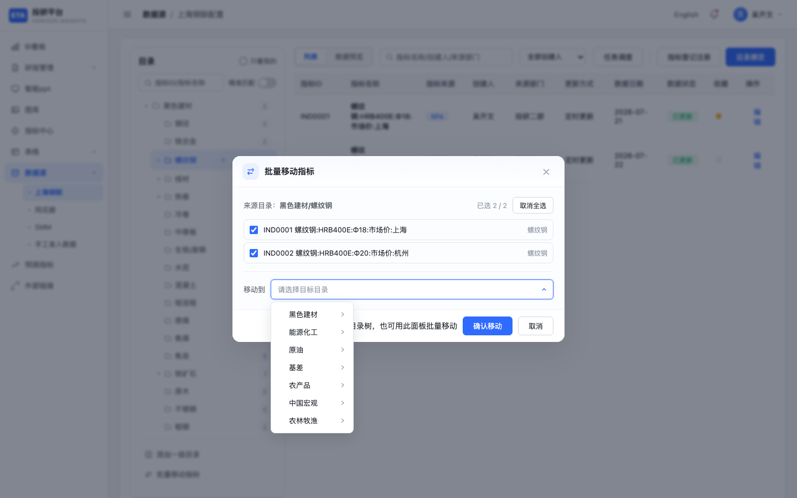

| 编号 | 区域 | 需求说明 | 交互说明 |
|------|------|----------|----------|
| ① | 入口 | 目录重组时批量改挂，避免逐条拖拽 | 底部「批量移动指标」（需已选有指标目录） |
| ② | 来源目录 / 已选 | 明确移动范围，支持部分勾选 | 展示来源路径；勾选列表；「全选」 |
| ③ | 移动到 | 目标目录用级联选择，支持跨级迁移 | 级联选目标；未选不可确认 |
| ④ | 确认移动 | 批量更新 `dir` 并保持计数一致；拖拽为补充手段 | 确认后刷新；亦支持拖拽到树 |
| ⑤ | 取消 / ✕ | 不落库退出 | 关闭 |

---

## 6. 同花顺 / SMM 差异批注

三源共用同一套需求与交互（§1～§5），差异主要在**目录树内容与厂商标签**。

### 6.1 同花顺

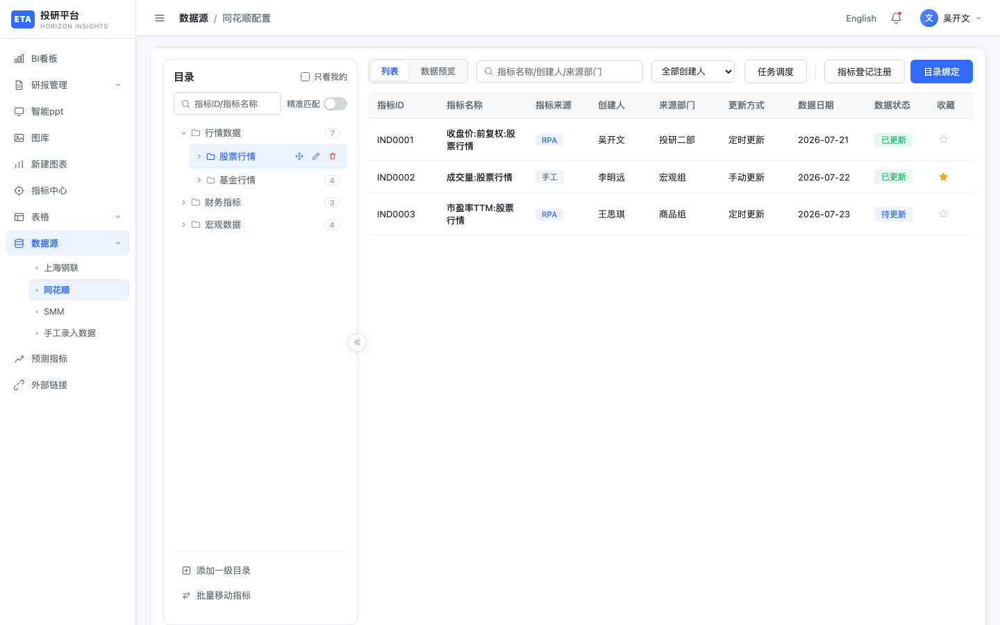

| 编号 | 区域 | 需求说明 | 交互说明 |
|------|------|----------|----------|
| ① | 侧栏「同花顺」 | 金融市场源独立配置上下文 | 面包屑：`数据源 / 同花顺配置` |
| ② | 目录 | 覆盖行情 / 财务 / 宏观分类 | 行情（股票/基金）、财务指标、宏观数据 |
| ③ | 典型指标 | 以价量、估值、市值类指标为主 | 收盘价、成交量、PE/PB、总市值、换手率等 |
| ④ | 来源表现 | 导出与对接标签为 iFinD | 列表可见 RPA/手工；导出标签 **iFinD** |
| ⑤ | 主操作 | 与钢联能力对齐 | 任务调度 / 登记 / 绑定 |

### 6.2 SMM

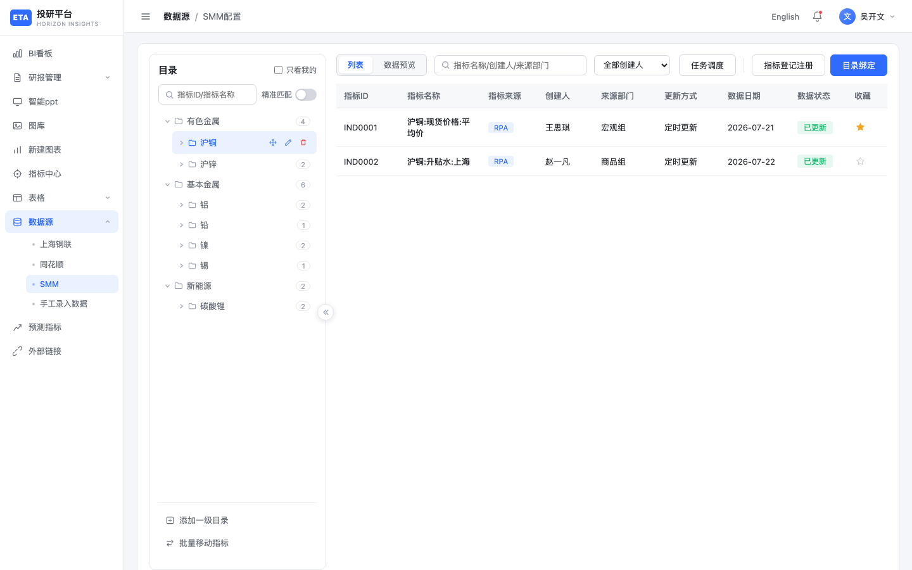

| 编号 | 区域 | 需求说明 | 交互说明 |
|------|------|----------|----------|
| ① | 侧栏「SMM」 | 有色与新能源行业源独立配置 | 面包屑：`数据源 / SMM配置` |
| ② | 目录 | 覆盖有色、基本金属、新能源 | 沪铜/沪锌、基本金属、碳酸锂等 |
| ③ | 典型指标 | 以现货、升贴水、库存为主 | 现货价、升贴水、库存等 |
| ④ | 导出标签 | 对接标签为 Smm | 导出 **Smm** |
| ⑤ | 收藏 | 默认不强制收藏 | 用户可手动星标 |

---

## 7. 手工录入数据

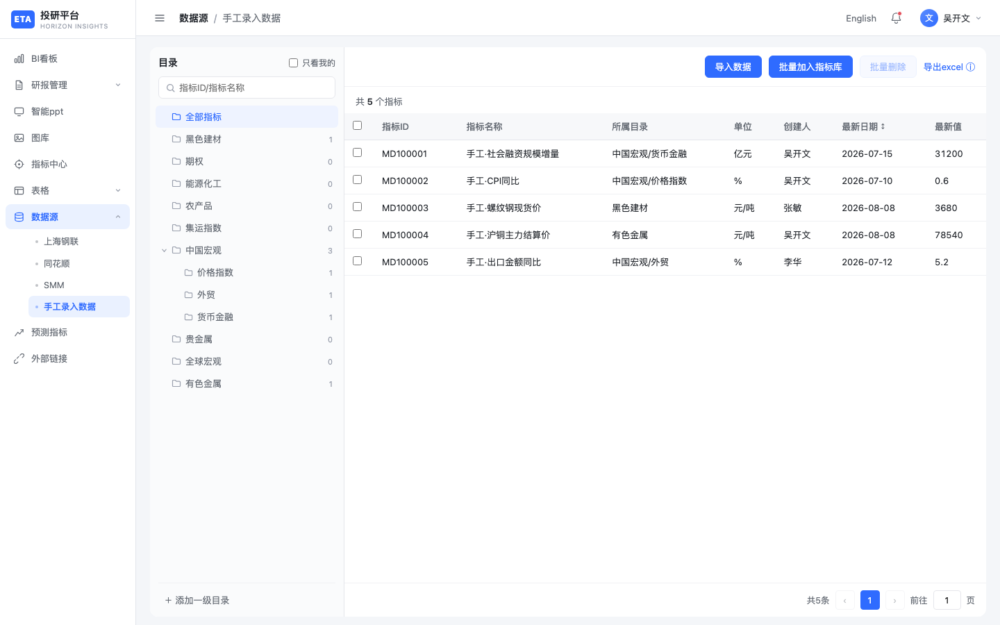

| 编号 | 区域 | 需求说明 | 交互说明 |
|------|------|----------|----------|
| ① | 入口 | 厂商未覆盖或需人工维护的数据入口；嵌入数据源菜单，不整页跳转 | 侧栏「手工录入数据」；面包屑 `数据源 / 手工录入数据`（iframe） |
| ② | 导入数据 | Excel 是主补数通道，需模板化与失败可追溯 | 打开导入弹窗（§7.1） |
| ③ | 批量加入指标库 | 手工库与指标中心解耦；确认后才进入下游消费 | **两步弹窗**对齐目录绑定；来源标记「手工」；列表勾选可预选 |
| ④ | 批量删除 | 清理误导入/废弃指标 | 未勾选禁用 |
| ⑤ | 右侧工具栏 | 主操作集中；导出走工具栏，不做行内下载 | 导入 / 批量加入 / 批量删除 / 导出靠右；无表头「只看我的」；无单行下载 |
| ⑥ | 目录树 | 与指标中心目录对齐；「只看我的」在目录区 | 顶满左侧；可添加一级、搜索、展开 |
| ⑦ | 指标列表区 | 展示手工点位聚合后的指标摘要 | 勾选、ID、名称、目录、单位、创建人、最新日期、最新值；空态「暂无数据」 |
| ⑧ | 分页 | 大数据量分页加载 | 底部分页与跳转 |

### 7.0a 批量加入 · 步骤2（级联目录）

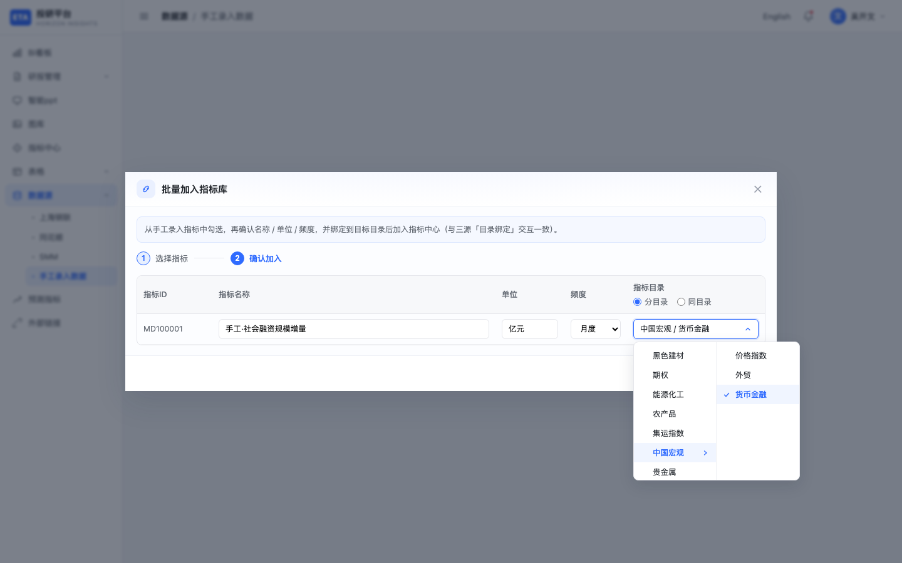

| 编号 | 区域 | 需求说明 | 交互说明 |
|------|------|----------|----------|
| ① | 步骤条 | 与三源绑定一致的两步确认 | 高亮「确认加入」 |
| ② | 可编辑字段 | 加入前可校正展示口径 | 名称 / 单位 / 频度 |
| ③ | 目录策略 | 必须明确指标中心落点目录；iframe 内级联不可裁切 | 「分目录 / 同目录」+ **级联** |
| ④ | 确认加入 | 写入指标中心（来源=手工）并回写手工库；已加入不再出现在可选池 | Toast 提示条数与目标 |

### 7.1 导入数据弹窗

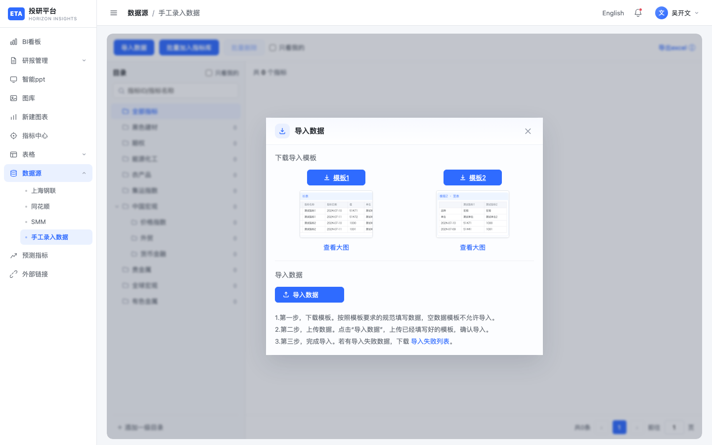

| 编号 | 区域 | 需求说明 | 交互说明 |
|------|------|----------|----------|
| ① | 「导入数据」上传（置顶） | 主操作优先；解析后进独立预览，避免在上传弹窗内嵌复杂表 | 上传已填模板 → 打开「导入预览」 |
| ② | 步骤说明 | 标准化导入路径，降低培训成本 | 上传 → 预览确认 → 失败可下失败列表 |
| ③ | 下载模板1 / 模板2（下方） | 提供行式与宽表两种模板适配不同填报习惯 | 模板区置底；可「查看大图」 |
| ④ | 导入失败列表 | 失败行可下载含备注，支撑修正重传 | 链接触发下载 |
| ⑤ | 关闭 ✕ | 关闭上传入口 | 关闭弹窗 |

### 7.2 导入预览弹窗（独立）

| 编号 | 区域 | 需求说明 | 交互说明 |
|------|------|----------|----------|
| ① | 标题「导入预览」 | 确认态与上传态分离，降低误导入 | 解析成功后切换至此 |
| ② | 文件摘要 | 导入前感知规模 | 文件名、条数、指标数 |
| ③ | 预览表 | 抽查字段正确性 | 品种 / 名称 / 日期 / 值 / 单位 |
| ④ | 确认导入 | 写入库并反馈成败 | 结果在顶部；失败可下失败列表 |
| ⑤ | 取消 / 完成 | 取消放弃；完成关闭 | 对应按钮 |

**校验要点（导入/在线录入共用）：** 品种或目录、名称、日期（`YYYY-MM-DD`）、数值、频度、单位均必填；同名多日点位聚合为一条指标；品种「宏观」映射到「中国宏观」。

---

## 8. 目录治理（三源与手工共用规则）

| 操作 | 需求说明 | 交互说明 |
|------|----------|----------|
| 展开/收起 | 控制树信息密度 | 点击节点箭头 |
| 选中 | 决定右侧列表/预览范围 | 点击节点刷新右侧 |
| 深度 | **最多 6 级**，防止无限嵌套 | 第 6 级隐藏「＋」；再下挂 Toast 拦截 |
| 添加一级 | 根分类由底部入口创建 | 弹窗输入名称（建议 ≤20 字） |
| 添加子目录 | 子级就地创建，路径 `父/子` | 悬停「＋」（操作区左侧）→ 命名 |
| 重命名 | 改名需同步指标 `dir`，防孤儿路径 | 行「编辑」保存后同步 |
| 删除 | 有指标时禁止删除，防误删资产 | 确认弹窗；有指标隐藏「删除」 |
| 拖拽 / 批量移动 | 支持重组挂载关系 | 拖拽或批量移动弹窗（级联目标） |
| 折叠面板 | 扩大列表可视区 | 收起左侧目录区 |

**级联选择器（共用）：**

| 规则 | 需求说明 | 交互说明 |
|------|----------|----------|
| 展开 | 深目录需多列浏览 | 点击触发器；有子级箭头；叶子可勾选 |
| 展示 | 路径可读、可回写 | 触发器 `一级 / 二级 / …`；隐藏域完整路径 |
| 尺寸 | 防弹窗被撑破 | 限最大宽高，列内滚动 |
| 层级 | 与目录 ≤6 级一致 | 不提供超限节点 |
| 裁切 | 表格/iframe 内必须可选 | portal 到 `body` |
| Esc | 分层关闭，避免误关弹窗 | 先收级联，再关弹窗 |

**删除目录确认弹窗：**

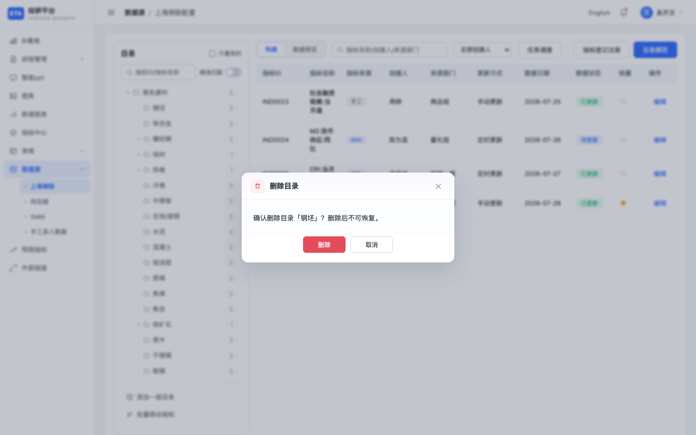

| 情况 | 需求说明 | 交互 |
|------|----------|------|
| 空目录 | 允许删除空结构 | 文案确认后可点「删除」 |
| 目录下仍有指标 | **禁止删除**，须先移出或删指标 | 提示原因；**隐藏「删除」**，仅可取消/关闭 |

---

## 9. 端到端路径（批注速查）

**A. 钢联日度价自动入库**  
侧栏上海钢联 → 选 `黑色建材/螺纹钢` → 目录绑定勾选指标 → 确认单位/频度 → 任务调度开启「黑色建材·日度同步」→ 预览/指标中心消费。

**B. 同花顺已知 ID 登记**  
同花顺配置 → 指标登记注册 → 录入登记 → 填 ID/目录/来源=同花顺数据 → 保存 → 纳入对应频度任务。

**C. 手工补宏观**  
手工录入 → 导入数据 → 下模板1 → 填品种=宏观等 → 上传确认 → 失败下失败列表 → 批量加入指标库（两步确认目录）→ 指标中心可消费。

---

## 10. 验收清单（对照原型）

**三源**

- [ ] 四入口切换正确，面包屑正确  
- [ ] 目录最多 6 级；悬停显示「＋」与行内操作；第 6 级无「＋」  
- [ ] 有指标时删目录走确认弹窗且不可删除；空目录可确认删除  
- [ ] 列表/树可编辑指标：级联分类 + 名称可改；指标 ID 置灰不可改  
- [ ] 登记行所属目录为级联；厂商来源→定时更新；手工→手动更新  
- [ ] Excel 注册需模板，空模板不可导入  
- [ ] 目录绑定两步可前进/后退；步骤2目标目录为级联且面板不被裁切  
- [ ] 批量移动：勾选指标 + 级联选目标目录后可确认移动  
- [ ] 任务调度为底部 90% 抽屉 + 背景模糊；三源共用  
- [ ] 筛选含：调度分类 / 执行时间 / 配置状态 / 触发方式 / 状态，可组合过滤  
- [ ] 触发方式仅「系统默认调度」「自动调度」两种；筛选与列表一致，无「手动执行」  
- [ ] 未配置任务调度时间文案为「按照系统调度执行」；保存配置后变为自动调度  
- [ ] 状态列仅开关、无右侧文案；操作列为编辑 + 立即执行/暂停同位切换 + 日志  
- [ ] 编辑可设每天/周/旬/月等；每周多选星期；旬/季/半年/年不选具体日期；高级含失败重跑  
- [ ] 执行日志为居中弹窗明细表  
- [ ] 登记入口可下载「数据登记注册 Excel 模板」  
- [ ] 数据预览随频度切换  
- [ ] 批注文档每区域具备需求说明 + 交互说明  

**手工**

- [ ] 导入弹窗：上传置顶、模板置底；解析后进独立预览弹窗确认  
- [ ] 模板1/2 可下载；空模板不可导入  
- [ ] 失败可下失败列表  
- [ ] 「宏观」→ 中国宏观  
- [ ] 批量加入指标库为两步弹窗（选指标 → 级联确认目录），与三源目录绑定一致  
- [ ] iframe 内级联面板可见、不被裁切  
- [ ] 列表无单行「下载」列；导出走工具栏  

---

## 11. 截图索引

| 文件 | 内容 |
|------|------|
| `01-gl-config.png` | 钢联配置（空目录） |
| `01b-gl-leaf.png` | 钢联叶子目录列表 |
| `01c-gl-preview.png` | 数据预览 |
| `02-ths-config.png` | 同花顺配置 |
| `03-smm-config.png` | SMM 配置 |
| `04-manual-embedded.png` | 手工录入主界面 |
| `06-task-modal.png` | 任务调度底部抽屉 |
| `06b-task-sched-config.png` | 配置调度时间 · 基础配置 |
| `06b2-task-sched-advanced.png` | 配置调度时间 · 高级配置（规则） |
| `06c-task-logs.png` | 任务/指标日志 |
| `07-reg-choice.png` | 登记方式选择 |
| `08-reg-form.png` | 录入登记（级联目录） |
| `09-bind-step1.png` / `09b-bind-step2.png` | 目录绑定两步（步骤2含级联） |
| `10-excel-reg.png` | Excel 导入注册 |
| `11-manual-import.png` | 手工导入弹窗 |
| `12-edit-ind-modal.png` | 编辑指标（级联分类） |
| `13-del-dir-modal.png` | 删除目录确认 |
| `14-batch-move-cascader.png` | 批量移动（级联目标目录） |
| `15-manual-lib-cascader.png` | 手工批量加入步骤2（级联） |

---

**文档结束**（批注版 V2.0；详细对象模型与校验枚举见 `数据源模块-产品需求文档.md`）
